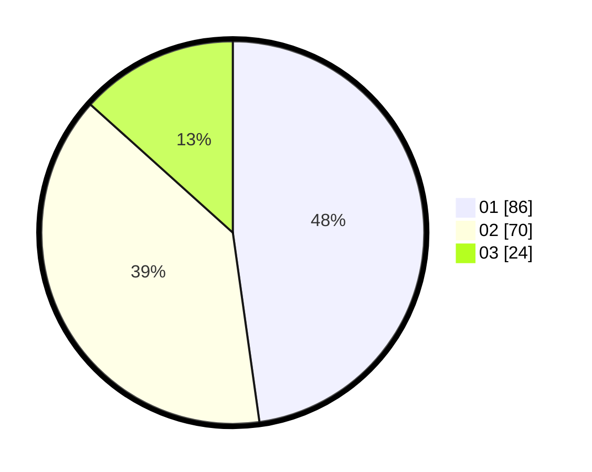

# Hasil

Hasil perolehan suara paslon dapat dilihat pada file paslon-01.txt, paslon-02.txt, dan paslon-03.txt.

Jika tidak ada, artinya data tersebut belum ada pada SIREKAP.

## Perolehan Suara

 * Paslon 01: **86**.
 * Paslon 02: **70**.
 * Paslon 03: **24**.

## Foto C Plano

https://sirekap-obj-formc.kpu.go.id/3b86/pemilu/ppwp/31/71/08/10/04/3171081004130-20240214-141458--0048bc8b-6f47-4637-acf5-e8be68b4570f.jpg

https://sirekap-obj-formc.kpu.go.id/3b86/pemilu/ppwp/31/71/08/10/04/3171081004130-20240214-194255--8e248530-7baf-41dc-82e8-cb33af72fcce.jpg

https://sirekap-obj-formc.kpu.go.id/3b86/pemilu/ppwp/31/71/08/10/04/3171081004130-20240214-185152--c5369f78-c3a7-4440-8a48-a9472ad8a01a.jpg

## DATA PEMILIH TETAP

Jumlah pemilih dalam DPT: **260**.
 * L: **130**.
 * P: **130**.

## DATA PENGGUNA HAK PILIH

Jumlah pengguna hak pilih dalam DPT: **180**.
 * L: **88**.
 * P: **92**.

Jumlah pengguna hak pilih dalam DPTb: **0**.
 * L: **0**.
 * P: **0**.

Jumlah pengguna hak pilih dalam DPK: **0**.
 * L: **0**.
 * P: **0**.

Jumlah pengguna hak pilih: **180**.
 * L: **88**.
 * P: **92**.

## JUMLAH SUARA SAH DAN TIDAK SAH

JUMLAH SELURUH SUARA SAH: **180**.

JUMLAH SUARA TIDAK SAH: **0**.

JUMLAH SELURUH SUARA SAH DAN SUARA TIDAK SAH: **180**.
