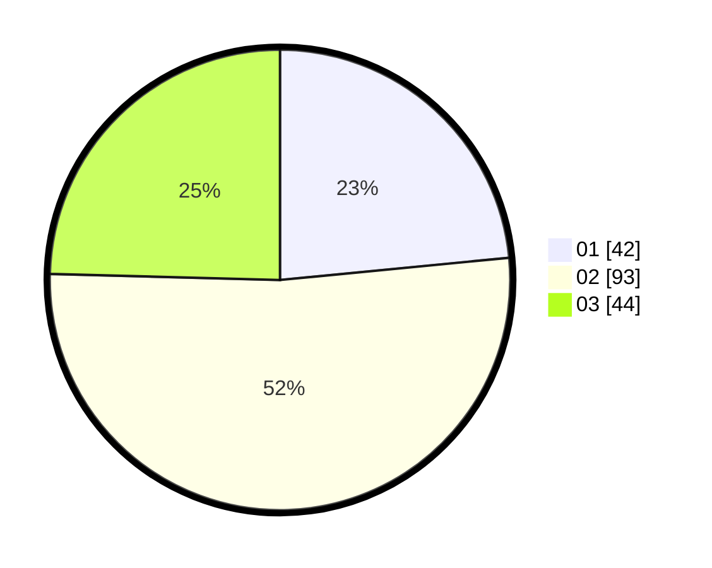

# Hasil

Hasil perolehan suara paslon dapat dilihat pada file paslon-01.txt, paslon-02.txt, dan paslon-03.txt.

Jika tidak ada, artinya data tersebut belum ada pada SIREKAP.

## Perolehan Suara

 * Paslon 01: **42**.
 * Paslon 02: **93**.
 * Paslon 03: **44**.

## Foto C Plano

https://sirekap-obj-formc.kpu.go.id/f95d/pemilu/ppwp/31/71/08/10/04/3171081004132-20240216-152212--2f16aee7-d5f0-4a3e-9934-b90e0c00c927.jpg

https://sirekap-obj-formc.kpu.go.id/f95d/pemilu/ppwp/31/71/08/10/04/3171081004132-20240216-152213--baaddfd4-b49f-4087-905f-7cf30842bc67.jpg

https://sirekap-obj-formc.kpu.go.id/f95d/pemilu/ppwp/31/71/08/10/04/3171081004132-20240216-152213--99cf7570-753b-4c5e-a511-e27b040ba61e.jpg

## DATA PEMILIH TETAP

Jumlah pemilih dalam DPT: **249**.
 * L: **119**.
 * P: **130**.

## DATA PENGGUNA HAK PILIH

Jumlah pengguna hak pilih dalam DPT: **177**.
 * L: **85**.
 * P: **92**.

Jumlah pengguna hak pilih dalam DPTb: **0**.
 * L: **0**.
 * P: **0**.

Jumlah pengguna hak pilih dalam DPK: **2**.
 * L: **0**.
 * P: **2**.

Jumlah pengguna hak pilih: **179**.
 * L: **85**.
 * P: **94**.

## JUMLAH SUARA SAH DAN TIDAK SAH

JUMLAH SELURUH SUARA SAH: **179**.

JUMLAH SUARA TIDAK SAH: **0**.

JUMLAH SELURUH SUARA SAH DAN SUARA TIDAK SAH: **179**.
