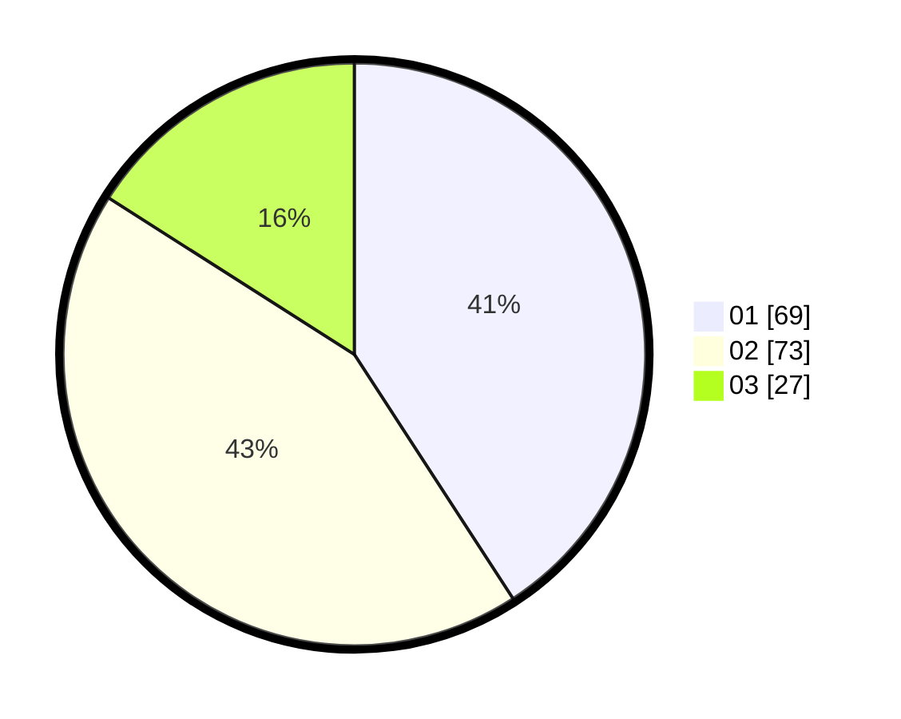

# Hasil

Hasil perolehan suara paslon dapat dilihat pada file paslon-01.txt, paslon-02.txt, dan paslon-03.txt.

Jika tidak ada, artinya data tersebut belum ada pada SIREKAP.

## Perolehan Suara

 * Paslon 01: **69**.
 * Paslon 02: **73**.
 * Paslon 03: **27**.

## Foto C Plano

https://sirekap-obj-formc.kpu.go.id/e8b6/pemilu/ppwp/31/71/08/10/04/3171081004133-20240216-153537--3beea842-f258-4d5c-9288-e37de24dfd9a.jpg

https://sirekap-obj-formc.kpu.go.id/e8b6/pemilu/ppwp/31/71/08/10/04/3171081004133-20240216-153538--0d6f2ce9-38e0-4438-8b2e-418b847cec56.jpg

https://sirekap-obj-formc.kpu.go.id/e8b6/pemilu/ppwp/31/71/08/10/04/3171081004133-20240216-153537--e6027f80-2581-4ff4-acae-e1ce6f2e7ae6.jpg

## DATA PEMILIH TETAP

Jumlah pemilih dalam DPT: **250**.
 * L: **93**.
 * P: **157**.

## DATA PENGGUNA HAK PILIH

Jumlah pengguna hak pilih dalam DPT: **169**.
 * L: **81**.
 * P: **88**.

Jumlah pengguna hak pilih dalam DPTb: **2**.
 * L: **1**.
 * P: **1**.

Jumlah pengguna hak pilih dalam DPK: **1**.
 * L: **1**.
 * P: **0**.

Jumlah pengguna hak pilih: **172**.
 * L: **83**.
 * P: **89**.

## JUMLAH SUARA SAH DAN TIDAK SAH

JUMLAH SELURUH SUARA SAH: **169**.

JUMLAH SUARA TIDAK SAH: **3**.

JUMLAH SELURUH SUARA SAH DAN SUARA TIDAK SAH: **172**.
