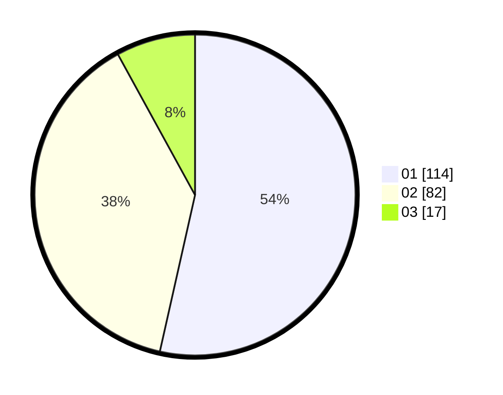

# Hasil

Hasil perolehan suara paslon dapat dilihat pada file paslon-01.txt, paslon-02.txt, dan paslon-03.txt.

Jika tidak ada, artinya data tersebut belum ada pada SIREKAP.

## Perolehan Suara

 * Paslon 01: **114**.
 * Paslon 02: **82**.
 * Paslon 03: **17**.

## Foto C Plano

https://sirekap-obj-formc.kpu.go.id/a158/pemilu/ppwp/31/72/01/10/01/3172011001001-20240217-140650--804c1177-cdc4-40a8-823a-851c313d764a.jpg

https://sirekap-obj-formc.kpu.go.id/a158/pemilu/ppwp/31/72/01/10/01/3172011001001-20240217-140707--99f89b5c-73b5-4eb4-b89b-16c5e59c434f.jpg

https://sirekap-obj-formc.kpu.go.id/a158/pemilu/ppwp/31/72/01/10/01/3172011001001-20240215-145851--4c0891f2-b72a-4118-8085-87930385c440.jpg
