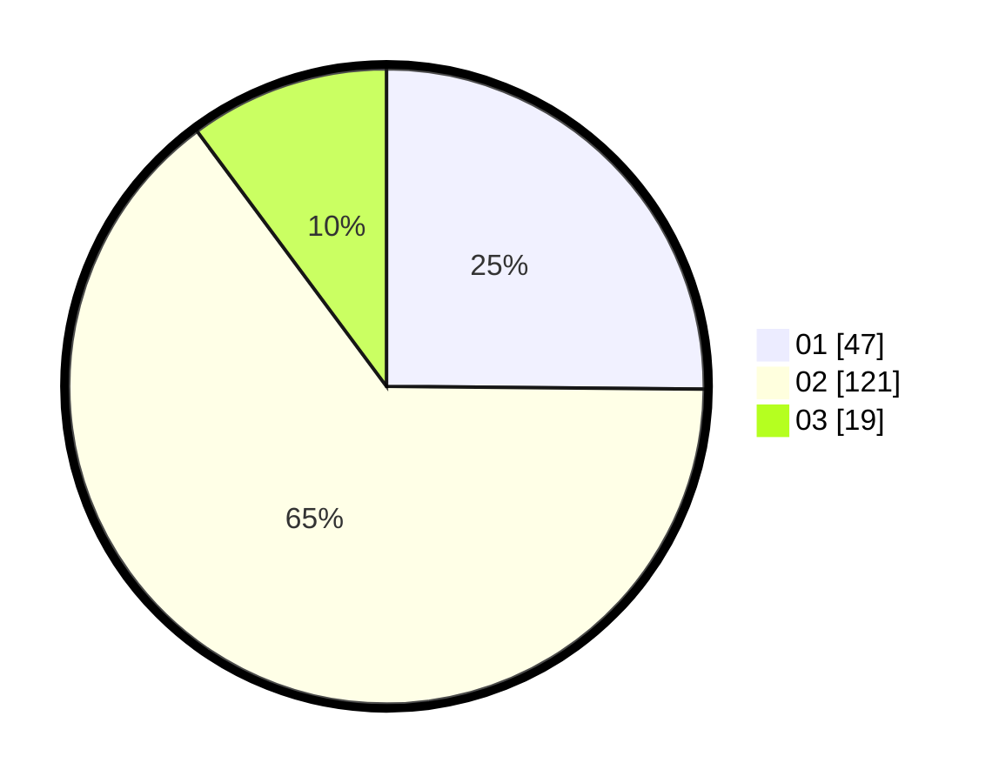

# Hasil

Hasil perolehan suara paslon dapat dilihat pada file paslon-01.txt, paslon-02.txt, dan paslon-03.txt.

Jika tidak ada, artinya data tersebut belum ada pada SIREKAP.

## Perolehan Suara

 * Paslon 01: **47**.
 * Paslon 02: **121**.
 * Paslon 03: **19**.

## Foto C Plano

https://sirekap-obj-formc.kpu.go.id/3105/pemilu/ppwp/31/72/01/10/01/3172011001038-20240215-230644--a1b31a05-aebf-474c-905c-6ddafb4319d4.jpg

https://sirekap-obj-formc.kpu.go.id/3105/pemilu/ppwp/31/72/01/10/01/3172011001038-20240216-165310--e434e3b6-94ff-40d9-a191-a028911842b5.jpg

https://sirekap-obj-formc.kpu.go.id/3105/pemilu/ppwp/31/72/01/10/01/3172011001038-20240216-165309--73b1ae9e-6030-4018-9985-d7710f8948eb.jpg

## DATA PEMILIH TETAP

Jumlah pemilih dalam DPT: **277**.
 * L: **150**.
 * P: **127**.

## DATA PENGGUNA HAK PILIH

Jumlah pengguna hak pilih dalam DPT: **190**.
 * L: **95**.
 * P: **95**.

Jumlah pengguna hak pilih dalam DPTb: **0**.
 * L: **0**.
 * P: **0**.

Jumlah pengguna hak pilih dalam DPK: **0**.
 * L: **0**.
 * P: **0**.

Jumlah pengguna hak pilih: **190**.
 * L: **95**.
 * P: **95**.

## JUMLAH SUARA SAH DAN TIDAK SAH

JUMLAH SELURUH SUARA SAH: **187**.

JUMLAH SUARA TIDAK SAH: **3**.

JUMLAH SELURUH SUARA SAH DAN SUARA TIDAK SAH: **190**.
