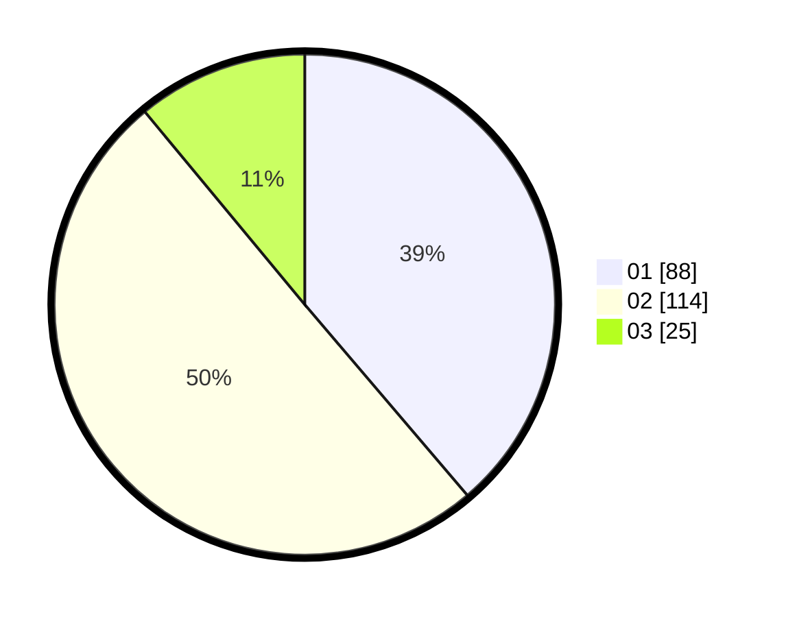

# Hasil

Hasil perolehan suara paslon dapat dilihat pada file paslon-01.txt, paslon-02.txt, dan paslon-03.txt.

Jika tidak ada, artinya data tersebut belum ada pada SIREKAP.

## Perolehan Suara

 * Paslon 01: **88**.
 * Paslon 02: **114**.
 * Paslon 03: **25**.

## Foto C Plano

https://sirekap-obj-formc.kpu.go.id/83fa/pemilu/ppwp/31/72/01/10/01/3172011001053-20240216-203555--cd7370e0-d46a-4201-8a88-4184aa892066.jpg

https://sirekap-obj-formc.kpu.go.id/83fa/pemilu/ppwp/31/72/01/10/01/3172011001053-20240215-010111--96d73e47-1b2c-4968-b97f-df02e7733851.jpg

https://sirekap-obj-formc.kpu.go.id/83fa/pemilu/ppwp/31/72/01/10/01/3172011001053-20240215-000033--01f40e9b-fb5e-4d50-877c-6b3e6a8a2ab6.jpg
