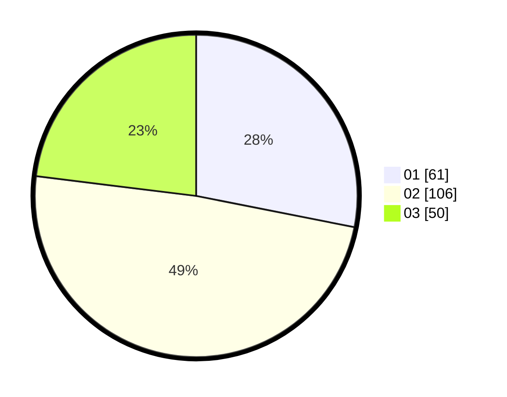

# Hasil

Hasil perolehan suara paslon dapat dilihat pada file paslon-01.txt, paslon-02.txt, dan paslon-03.txt.

Jika tidak ada, artinya data tersebut belum ada pada SIREKAP.

## Perolehan Suara

 * Paslon 01: **61**.
 * Paslon 02: **106**.
 * Paslon 03: **50**.

## Foto C Plano

https://sirekap-obj-formc.kpu.go.id/2991/pemilu/ppwp/31/72/01/10/01/3172011001084-20240214-234041--f43c7579-f161-488d-8529-8bdea484ea70.jpg

https://sirekap-obj-formc.kpu.go.id/2991/pemilu/ppwp/31/72/01/10/01/3172011001084-20240214-234427--0d7ae683-85b5-4f65-9ae7-436fc5f736ae.jpg

https://sirekap-obj-formc.kpu.go.id/2991/pemilu/ppwp/31/72/01/10/01/3172011001084-20240214-234542--5a4509d5-2df1-4657-b92d-3ab1d908febd.jpg
