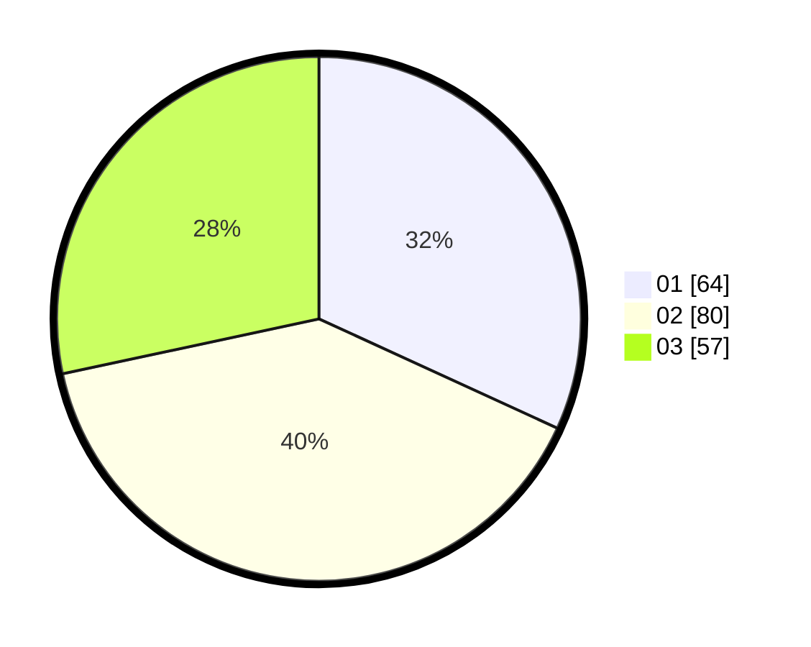

# Hasil

Hasil perolehan suara paslon dapat dilihat pada file paslon-01.txt, paslon-02.txt, dan paslon-03.txt.

Jika tidak ada, artinya data tersebut belum ada pada SIREKAP.

## Perolehan Suara

 * Paslon 01: **64**.
 * Paslon 02: **80**.
 * Paslon 03: **57**.

## Foto C Plano

https://sirekap-obj-formc.kpu.go.id/1bf3/pemilu/ppwp/31/72/01/10/01/3172011001110-20240214-233927--2a2b3521-77ea-468c-8e24-dd94b808797d.jpg

https://sirekap-obj-formc.kpu.go.id/1bf3/pemilu/ppwp/31/72/01/10/01/3172011001110-20240214-234213--198365c0-948c-4213-b96e-52b84f9ca24d.jpg

https://sirekap-obj-formc.kpu.go.id/1bf3/pemilu/ppwp/31/72/01/10/01/3172011001110-20240214-234353--e0ebd04a-3f1b-476e-8b32-f493487de569.jpg

## DATA PEMILIH TETAP

Jumlah pemilih dalam DPT: **285**.
 * L: **140**.
 * P: **145**.

## DATA PENGGUNA HAK PILIH

Jumlah pengguna hak pilih dalam DPT: **193**.
 * L: **93**.
 * P: **100**.

Jumlah pengguna hak pilih dalam DPTb: **5**.
 * L: **2**.
 * P: **3**.

Jumlah pengguna hak pilih dalam DPK: **4**.
 * L: **3**.
 * P: **1**.

Jumlah pengguna hak pilih: **202**.
 * L: **98**.
 * P: **104**.

## JUMLAH SUARA SAH DAN TIDAK SAH

JUMLAH SELURUH SUARA SAH: **201**.

JUMLAH SUARA TIDAK SAH: **1**.

JUMLAH SELURUH SUARA SAH DAN SUARA TIDAK SAH: **202**.
