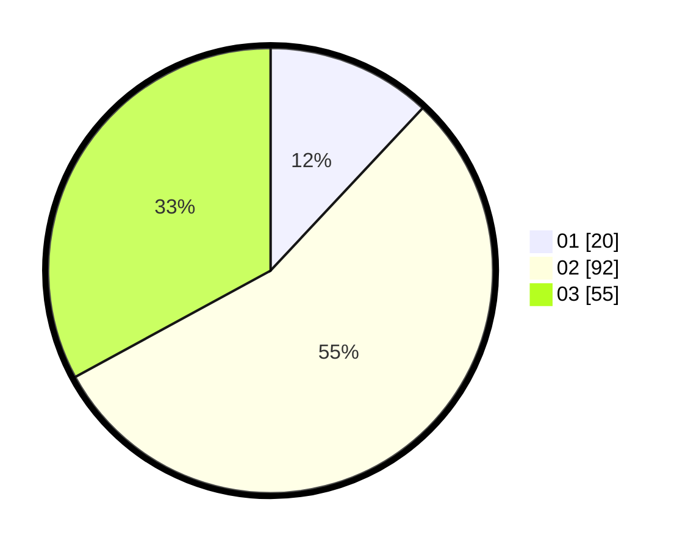

# Hasil

Hasil perolehan suara paslon dapat dilihat pada file paslon-01.txt, paslon-02.txt, dan paslon-03.txt.

Jika tidak ada, artinya data tersebut belum ada pada SIREKAP.

## Perolehan Suara

 * Paslon 01: **20**.
 * Paslon 02: **92**.
 * Paslon 03: **55**.

## Foto C Plano

https://sirekap-obj-formc.kpu.go.id/2331/pemilu/ppwp/31/72/01/10/01/3172011001120-20240214-205943--a2d55e5c-7843-4a86-b190-5bea2fc3020b.jpg

https://sirekap-obj-formc.kpu.go.id/2331/pemilu/ppwp/31/72/01/10/01/3172011001120-20240214-210152--83e5ef9d-363e-49e9-96dc-c9808b58ea3f.jpg

https://sirekap-obj-formc.kpu.go.id/2331/pemilu/ppwp/31/72/01/10/01/3172011001120-20240214-210302--f11f3a92-2cb5-457f-bbc3-76b520dd31a5.jpg
