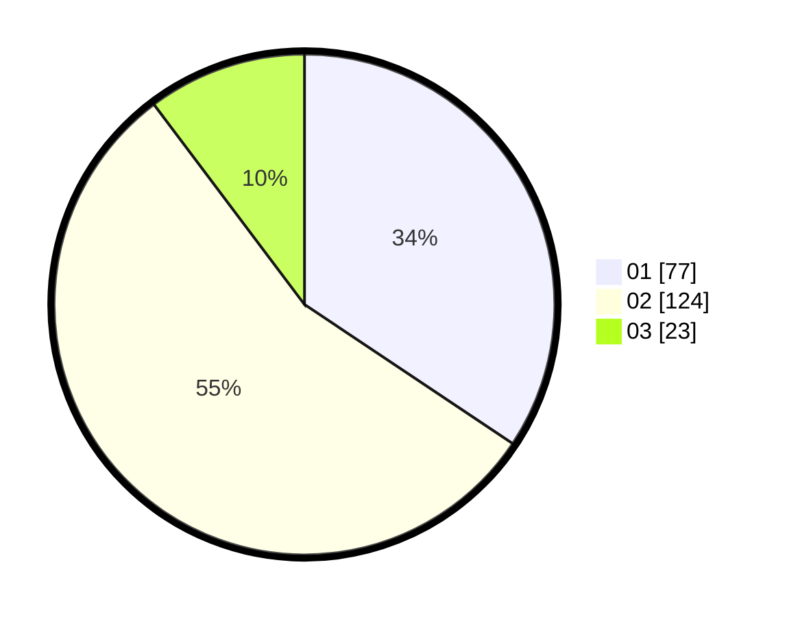

# Hasil

Hasil perolehan suara paslon dapat dilihat pada file paslon-01.txt, paslon-02.txt, dan paslon-03.txt.

Jika tidak ada, artinya data tersebut belum ada pada SIREKAP.

## Perolehan Suara

 * Paslon 01: **77**.
 * Paslon 02: **124**.
 * Paslon 03: **23**.

## Foto C Plano

https://sirekap-obj-formc.kpu.go.id/7e56/pemilu/ppwp/31/72/01/10/01/3172011001136-20240214-190344--f2ee28b6-c074-46f9-b0a4-34b9998282b0.jpg

https://sirekap-obj-formc.kpu.go.id/7e56/pemilu/ppwp/31/72/01/10/01/3172011001136-20240214-190954--19d29183-a1f7-430b-b0d4-5852a3845ec3.jpg

https://sirekap-obj-formc.kpu.go.id/7e56/pemilu/ppwp/31/72/01/10/01/3172011001136-20240214-191232--8f9d4fd3-608c-478f-a74c-dc39a2805910.jpg

## DATA PEMILIH TETAP

Jumlah pemilih dalam DPT: **291**.
 * L: **146**.
 * P: **145**.

## DATA PENGGUNA HAK PILIH

Jumlah pengguna hak pilih dalam DPT: **224**.
 * L: **109**.
 * P: **115**.

Jumlah pengguna hak pilih dalam DPTb: **1**.
 * L: **0**.
 * P: **1**.

Jumlah pengguna hak pilih dalam DPK: **2**.
 * L: **1**.
 * P: **1**.

Jumlah pengguna hak pilih: **227**.
 * L: **110**.
 * P: **117**.

## JUMLAH SUARA SAH DAN TIDAK SAH

JUMLAH SELURUH SUARA SAH: **224**.

JUMLAH SUARA TIDAK SAH: **3**.

JUMLAH SELURUH SUARA SAH DAN SUARA TIDAK SAH: **227**.
