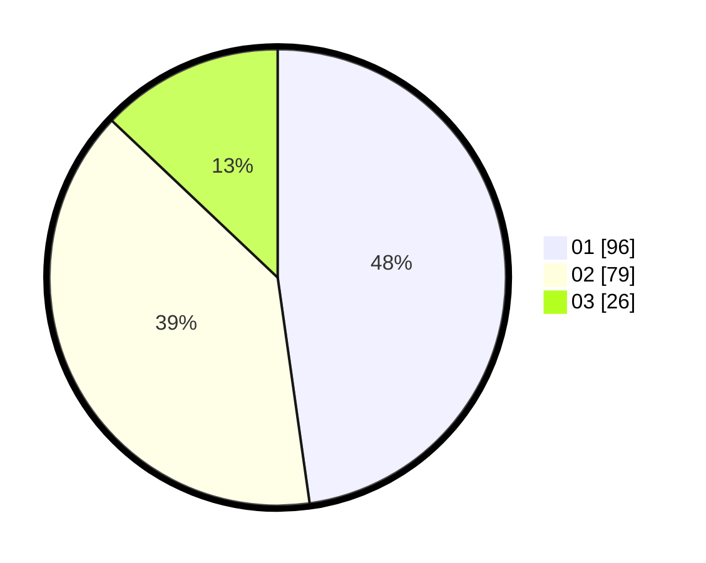

# Hasil

Hasil perolehan suara paslon dapat dilihat pada file paslon-01.txt, paslon-02.txt, dan paslon-03.txt.

Jika tidak ada, artinya data tersebut belum ada pada SIREKAP.

## Perolehan Suara

 * Paslon 01: **96**.
 * Paslon 02: **79**.
 * Paslon 03: **26**.

## Foto C Plano

https://sirekap-obj-formc.kpu.go.id/fb63/pemilu/ppwp/31/72/01/10/01/3172011001171-20240215-004112--976f0832-9e8a-4724-a093-5359521910cf.jpg

https://sirekap-obj-formc.kpu.go.id/fb63/pemilu/ppwp/31/72/01/10/01/3172011001171-20240215-003950--3cfd5d96-1646-44ef-b7de-ea0537eb4b5a.jpg

https://sirekap-obj-formc.kpu.go.id/fb63/pemilu/ppwp/31/72/01/10/01/3172011001171-20240215-004233--c303a9e7-2f22-4e48-bfc9-f34578db4a09.jpg
