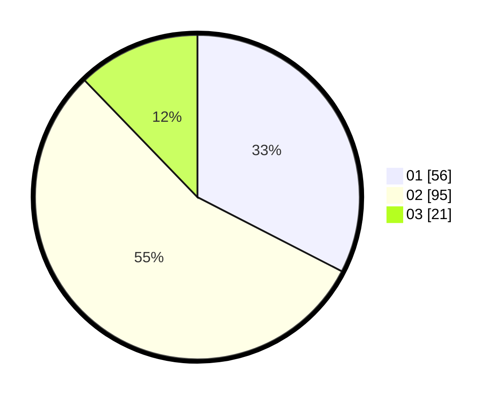

# Hasil

Hasil perolehan suara paslon dapat dilihat pada file paslon-01.txt, paslon-02.txt, dan paslon-03.txt.

Jika tidak ada, artinya data tersebut belum ada pada SIREKAP.

## Perolehan Suara

 * Paslon 01: **56**.
 * Paslon 02: **95**.
 * Paslon 03: **21**.

## Foto C Plano

https://sirekap-obj-formc.kpu.go.id/0997/pemilu/ppwp/31/72/01/10/01/3172011001238-20240215-024237--b23f231b-3e3b-4bfe-88c3-e6431cb73a87.jpg

https://sirekap-obj-formc.kpu.go.id/0997/pemilu/ppwp/31/72/01/10/01/3172011001238-20240216-140003--02eef505-230a-47d1-95af-55aa4e77b90c.jpg

https://sirekap-obj-formc.kpu.go.id/0997/pemilu/ppwp/31/72/01/10/01/3172011001238-20240215-024456--e7875796-58fa-4655-b70b-a6df24ae9409.jpg

## DATA PEMILIH TETAP

Jumlah pemilih dalam DPT: **293**.
 * L: **162**.
 * P: **131**.

## DATA PENGGUNA HAK PILIH

Jumlah pengguna hak pilih dalam DPT: **165**.
 * L: **83**.
 * P: **82**.

Jumlah pengguna hak pilih dalam DPTb: **9**.
 * L: **4**.
 * P: **5**.

Jumlah pengguna hak pilih dalam DPK: **1**.
 * L: **0**.
 * P: **1**.

Jumlah pengguna hak pilih: **175**.
 * L: **87**.
 * P: **88**.

## JUMLAH SUARA SAH DAN TIDAK SAH

JUMLAH SELURUH SUARA SAH: **172**.

JUMLAH SUARA TIDAK SAH: **3**.

JUMLAH SELURUH SUARA SAH DAN SUARA TIDAK SAH: **175**.
