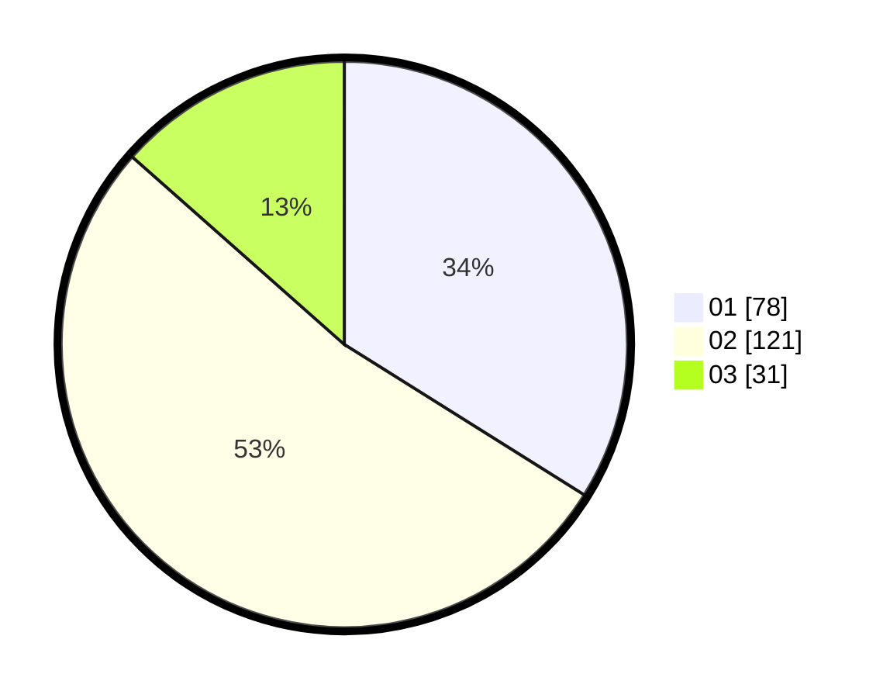

# Hasil

Hasil perolehan suara paslon dapat dilihat pada file paslon-01.txt, paslon-02.txt, dan paslon-03.txt.

Jika tidak ada, artinya data tersebut belum ada pada SIREKAP.

## Perolehan Suara

 * Paslon 01: **78**.
 * Paslon 02: **121**.
 * Paslon 03: **31**.

## Foto C Plano

https://sirekap-obj-formc.kpu.go.id/b538/pemilu/ppwp/31/72/01/10/01/3172011001245-20240215-225849--6fd7500c-a807-4173-8344-a7bc5c3e227f.jpg

https://sirekap-obj-formc.kpu.go.id/b538/pemilu/ppwp/31/72/01/10/01/3172011001245-20240215-225851--12262d48-c0de-4156-9078-1e635c40a5ba.jpg

https://sirekap-obj-formc.kpu.go.id/b538/pemilu/ppwp/31/72/01/10/01/3172011001245-20240215-225850--5b70b021-adb8-4376-a061-9baab68b9af4.jpg

## DATA PEMILIH TETAP

Jumlah pemilih dalam DPT: **229**.
 * L: **114**.
 * P: **115**.

## DATA PENGGUNA HAK PILIH

Jumlah pengguna hak pilih dalam DPT: **293**.
 * L: **155**.
 * P: **138**.

Jumlah pengguna hak pilih dalam DPTb: **0**.
 * L: **0**.
 * P: **0**.

Jumlah pengguna hak pilih dalam DPK: **0**.
 * L: **0**.
 * P: **0**.

Jumlah pengguna hak pilih: **293**.
 * L: **115**.
 * P: **138**.

## JUMLAH SUARA SAH DAN TIDAK SAH

JUMLAH SELURUH SUARA SAH: **230**.

JUMLAH SUARA TIDAK SAH: **7**.

JUMLAH SELURUH SUARA SAH DAN SUARA TIDAK SAH: **237**.
