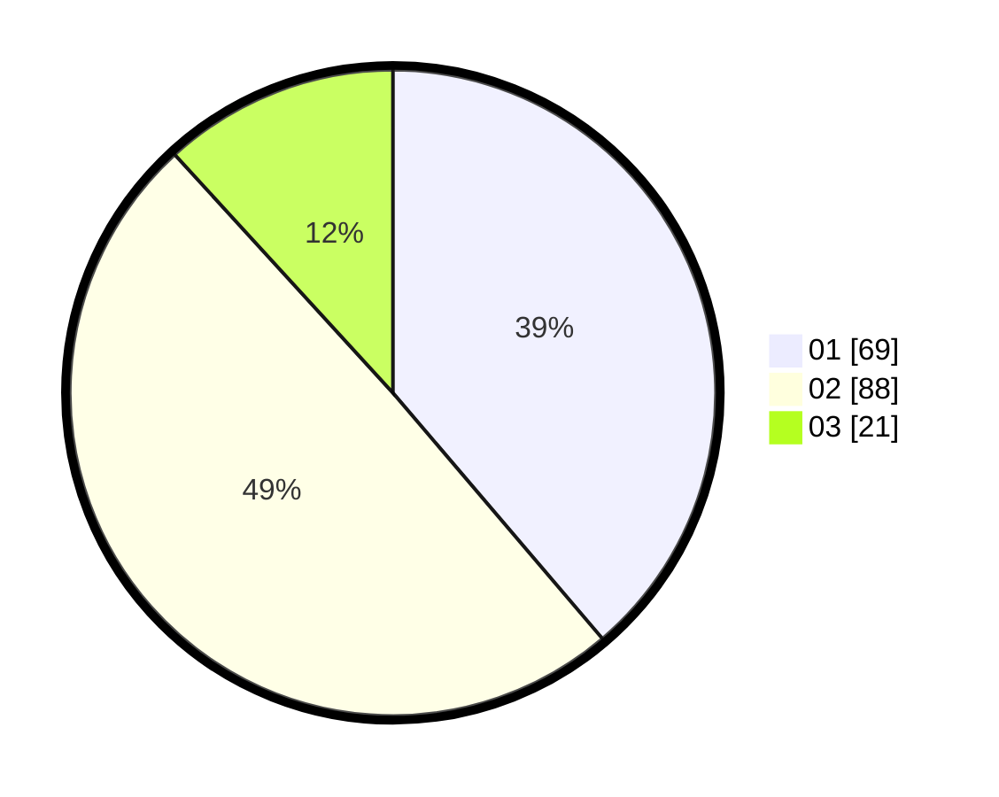

# Hasil

Hasil perolehan suara paslon dapat dilihat pada file paslon-01.txt, paslon-02.txt, dan paslon-03.txt.

Jika tidak ada, artinya data tersebut belum ada pada SIREKAP.

## Perolehan Suara

 * Paslon 01: **69**.
 * Paslon 02: **88**.
 * Paslon 03: **21**.

## Foto C Plano

https://sirekap-obj-formc.kpu.go.id/e6d3/pemilu/ppwp/31/72/01/10/01/3172011001259-20240214-194615--ef4dd4be-d2e6-411b-9953-1c8836bf4fce.jpg

https://sirekap-obj-formc.kpu.go.id/e6d3/pemilu/ppwp/31/72/01/10/01/3172011001259-20240214-194644--991e346b-0438-4a42-bf0f-2376d5d0b158.jpg

https://sirekap-obj-formc.kpu.go.id/e6d3/pemilu/ppwp/31/72/01/10/01/3172011001259-20240214-194714--b248ddb6-d48e-4e54-9bed-c3d4cc016c53.jpg

## DATA PEMILIH TETAP

Jumlah pemilih dalam DPT: **296**.
 * L: **159**.
 * P: **137**.

## DATA PENGGUNA HAK PILIH

Jumlah pengguna hak pilih dalam DPT: **180**.
 * L: **93**.
 * P: **87**.

Jumlah pengguna hak pilih dalam DPTb: **2**.
 * L: **1**.
 * P: **1**.

Jumlah pengguna hak pilih dalam DPK: **6**.
 * L: **4**.
 * P: **2**.

Jumlah pengguna hak pilih: **188**.
 * L: **98**.
 * P: **90**.

## JUMLAH SUARA SAH DAN TIDAK SAH

JUMLAH SELURUH SUARA SAH: **178**.

JUMLAH SUARA TIDAK SAH: **10**.

JUMLAH SELURUH SUARA SAH DAN SUARA TIDAK SAH: **188**.
