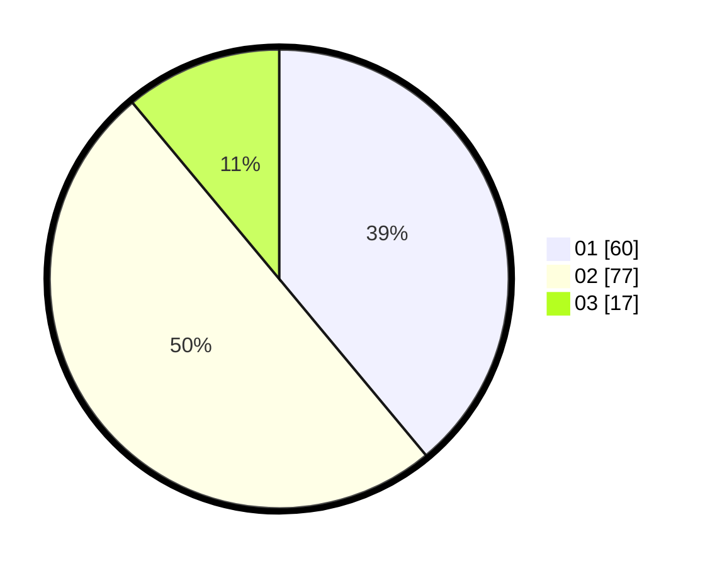

# Hasil

Hasil perolehan suara paslon dapat dilihat pada file paslon-01.txt, paslon-02.txt, dan paslon-03.txt.

Jika tidak ada, artinya data tersebut belum ada pada SIREKAP.

## Perolehan Suara

 * Paslon 01: **60**.
 * Paslon 02: **77**.
 * Paslon 03: **17**.

## Foto C Plano

https://sirekap-obj-formc.kpu.go.id/665f/pemilu/ppwp/31/72/01/10/01/3172011001293-20240214-184832--dbc7834e-353f-4018-9f2f-c03a380cc757.jpg

https://sirekap-obj-formc.kpu.go.id/665f/pemilu/ppwp/31/72/01/10/01/3172011001293-20240214-185001--004d12d9-ed39-419c-b727-beb138d8358a.jpg

https://sirekap-obj-formc.kpu.go.id/665f/pemilu/ppwp/31/72/01/10/01/3172011001293-20240214-185234--c9f5e7ed-f584-4980-8877-bd47f3b2ef62.jpg

## DATA PEMILIH TETAP

Jumlah pemilih dalam DPT: **239**.
 * L: **139**.
 * P: **100**.

## DATA PENGGUNA HAK PILIH

Jumlah pengguna hak pilih dalam DPT: **154**.
 * L: **67**.
 * P: **87**.

Jumlah pengguna hak pilih dalam DPTb: **1**.
 * L: **1**.
 * P: **0**.

Jumlah pengguna hak pilih dalam DPK: **2**.
 * L: **2**.
 * P: **0**.

Jumlah pengguna hak pilih: **157**.
 * L: **70**.
 * P: **87**.

## JUMLAH SUARA SAH DAN TIDAK SAH

JUMLAH SELURUH SUARA SAH: **154**.

JUMLAH SUARA TIDAK SAH: **3**.

JUMLAH SELURUH SUARA SAH DAN SUARA TIDAK SAH: **157**.
