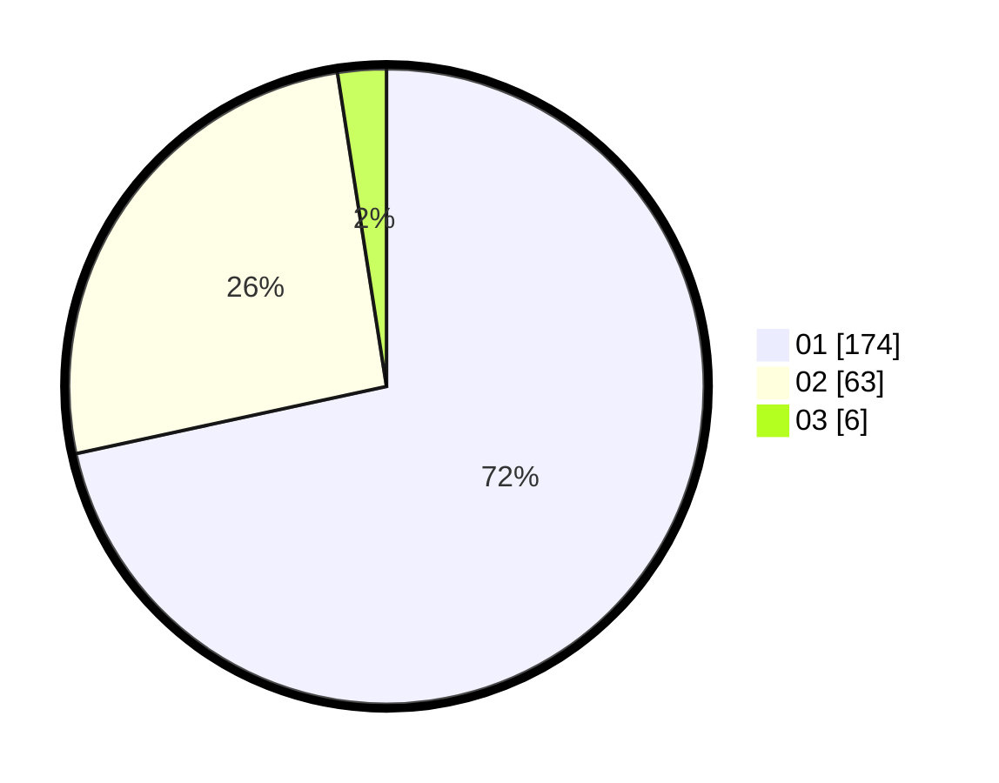

# Hasil

Hasil perolehan suara paslon dapat dilihat pada file paslon-01.txt, paslon-02.txt, dan paslon-03.txt.

Jika tidak ada, artinya data tersebut belum ada pada SIREKAP.

## Perolehan Suara

 * Paslon 01: **174**.
 * Paslon 02: **63**.
 * Paslon 03: **6**.

## Foto C Plano

https://sirekap-obj-formc.kpu.go.id/79a2/pemilu/ppwp/31/72/01/10/02/3172011002001-20240216-150937--da849b90-a2d8-4a49-9569-b81af5ce9c94.jpg

https://sirekap-obj-formc.kpu.go.id/79a2/pemilu/ppwp/31/72/01/10/02/3172011002001-20240216-151020--c7176a5f-aedb-4232-8995-6b6462b161db.jpg

https://sirekap-obj-formc.kpu.go.id/79a2/pemilu/ppwp/31/72/01/10/02/3172011002001-20240216-151124--ab0253d9-b552-4edb-b669-5eb7750098c3.jpg
