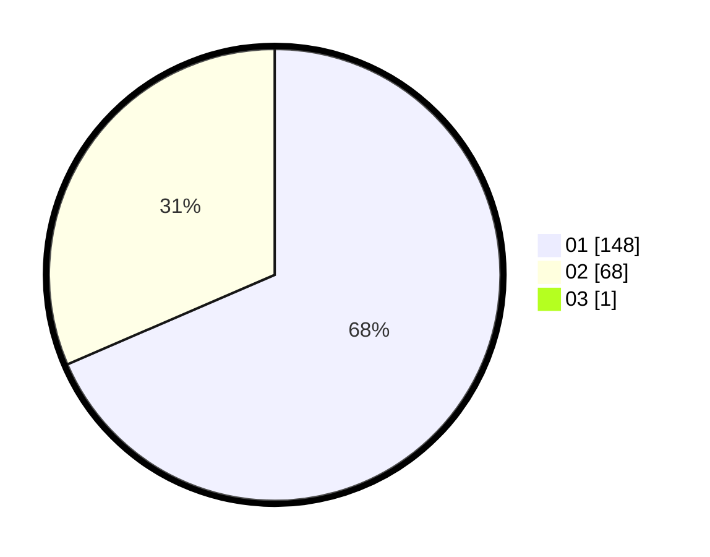

# Hasil

Hasil perolehan suara paslon dapat dilihat pada file paslon-01.txt, paslon-02.txt, dan paslon-03.txt.

Jika tidak ada, artinya data tersebut belum ada pada SIREKAP.

## Perolehan Suara

 * Paslon 01: **148**.
 * Paslon 02: **68**.
 * Paslon 03: **1**.

## Foto C Plano

https://sirekap-obj-formc.kpu.go.id/d84f/pemilu/ppwp/31/72/01/10/02/3172011002002-20240214-191238--1793c800-5798-46e3-8438-0dea80698bb9.jpg

https://sirekap-obj-formc.kpu.go.id/d84f/pemilu/ppwp/31/72/01/10/02/3172011002002-20240214-185313--5ae37cea-3f6c-42ce-8118-78ecb82d83a7.jpg

https://sirekap-obj-formc.kpu.go.id/d84f/pemilu/ppwp/31/72/01/10/02/3172011002002-20240214-185734--04ebb296-ca9e-4648-a232-d9fbe2e56f9a.jpg

## DATA PEMILIH TETAP

Jumlah pemilih dalam DPT: **277**.
 * L: **135**.
 * P: **142**.

## DATA PENGGUNA HAK PILIH

Jumlah pengguna hak pilih dalam DPT: **219**.
 * L: **101**.
 * P: **118**.

Jumlah pengguna hak pilih dalam DPTb: **0**.
 * L: **0**.
 * P: **0**.

Jumlah pengguna hak pilih dalam DPK: **3**.
 * L: **1**.
 * P: **2**.

Jumlah pengguna hak pilih: **222**.
 * L: **102**.
 * P: **120**.

## JUMLAH SUARA SAH DAN TIDAK SAH

JUMLAH SELURUH SUARA SAH: **217**.

JUMLAH SUARA TIDAK SAH: **5**.

JUMLAH SELURUH SUARA SAH DAN SUARA TIDAK SAH: **222**.
