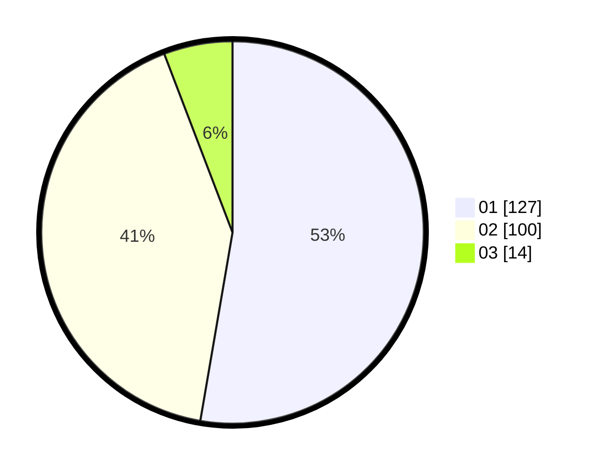

# Hasil

Hasil perolehan suara paslon dapat dilihat pada file paslon-01.txt, paslon-02.txt, dan paslon-03.txt.

Jika tidak ada, artinya data tersebut belum ada pada SIREKAP.

## Perolehan Suara

 * Paslon 01: **127**.
 * Paslon 02: **100**.
 * Paslon 03: **14**.

## Foto C Plano

https://sirekap-obj-formc.kpu.go.id/c59e/pemilu/ppwp/31/72/01/10/02/3172011002003-20240214-184556--1ef9de1e-faa9-41e1-8b57-35b2c9556dae.jpg

https://sirekap-obj-formc.kpu.go.id/c59e/pemilu/ppwp/31/72/01/10/02/3172011002003-20240215-035719--7cb9c103-ea61-4435-a454-e874721cd6a1.jpg

https://sirekap-obj-formc.kpu.go.id/c59e/pemilu/ppwp/31/72/01/10/02/3172011002003-20240214-185639--6ad78e42-cbfc-4833-a2c3-dcbadbd0f6d5.jpg

## DATA PEMILIH TETAP

Jumlah pemilih dalam DPT: **295**.
 * L: **755**.
 * P: **140**.

## DATA PENGGUNA HAK PILIH

Jumlah pengguna hak pilih dalam DPT: **252**.
 * L: **170**.
 * P: **122**.

Jumlah pengguna hak pilih dalam DPTb: **0**.
 * L: **0**.
 * P: **0**.

Jumlah pengguna hak pilih dalam DPK: **2**.
 * L: **1**.
 * P: **1**.

Jumlah pengguna hak pilih: **254**.
 * L: **171**.
 * P: **123**.

## JUMLAH SUARA SAH DAN TIDAK SAH

JUMLAH SELURUH SUARA SAH: **243**.

JUMLAH SUARA TIDAK SAH: **11**.

JUMLAH SELURUH SUARA SAH DAN SUARA TIDAK SAH: **254**.
