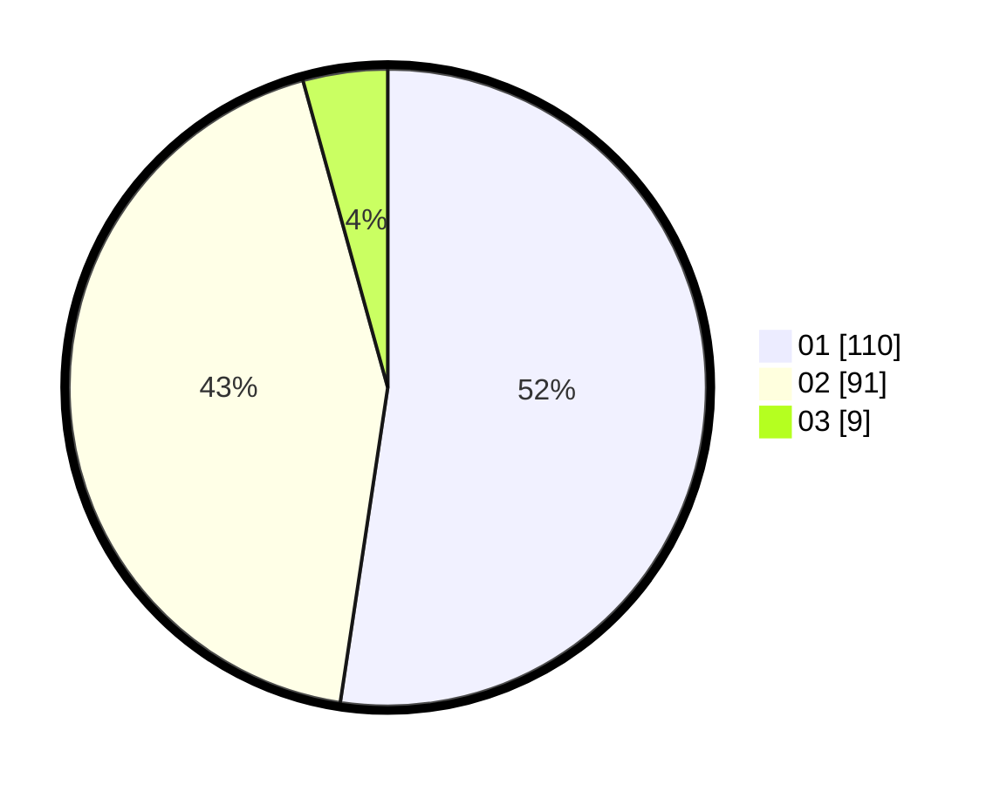

# Hasil

Hasil perolehan suara paslon dapat dilihat pada file paslon-01.txt, paslon-02.txt, dan paslon-03.txt.

Jika tidak ada, artinya data tersebut belum ada pada SIREKAP.

## Perolehan Suara

 * Paslon 01: **110**.
 * Paslon 02: **91**.
 * Paslon 03: **9**.

## Foto C Plano

https://sirekap-obj-formc.kpu.go.id/62c3/pemilu/ppwp/31/72/01/10/02/3172011002008-20240216-182641--f173045f-4681-4b73-a42b-aad463c89364.jpg

https://sirekap-obj-formc.kpu.go.id/62c3/pemilu/ppwp/31/72/01/10/02/3172011002008-20240216-182755--a9e808c5-7831-4358-bd8c-781873c11600.jpg

https://sirekap-obj-formc.kpu.go.id/62c3/pemilu/ppwp/31/72/01/10/02/3172011002008-20240216-182936--5b5faaa3-5c45-4058-ad85-854a2b6561fa.jpg

## DATA PEMILIH TETAP

Jumlah pemilih dalam DPT: **249**.
 * L: **127**.
 * P: **122**.

## DATA PENGGUNA HAK PILIH

Jumlah pengguna hak pilih dalam DPT: **193**.
 * L: **96**.
 * P: **97**.

Jumlah pengguna hak pilih dalam DPTb: **0**.
 * L: **0**.
 * P: **0**.

Jumlah pengguna hak pilih dalam DPK: **17**.
 * L: **10**.
 * P: **7**.

Jumlah pengguna hak pilih: **210**.
 * L: **106**.
 * P: **104**.

## JUMLAH SUARA SAH DAN TIDAK SAH

JUMLAH SELURUH SUARA SAH: **210**.

JUMLAH SUARA TIDAK SAH: **0**.

JUMLAH SELURUH SUARA SAH DAN SUARA TIDAK SAH: **210**.
