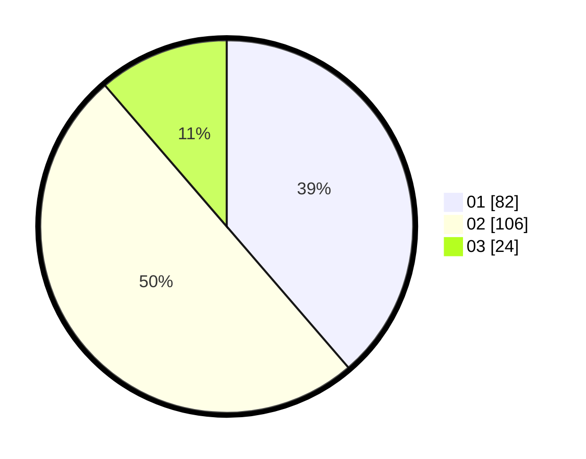

# Hasil

Hasil perolehan suara paslon dapat dilihat pada file paslon-01.txt, paslon-02.txt, dan paslon-03.txt.

Jika tidak ada, artinya data tersebut belum ada pada SIREKAP.

## Perolehan Suara

 * Paslon 01: **82**.
 * Paslon 02: **106**.
 * Paslon 03: **24**.

## Foto C Plano

https://sirekap-obj-formc.kpu.go.id/8711/pemilu/ppwp/31/72/01/10/02/3172011002009-20240216-195007--4ae59645-2d83-4374-96d9-918565d50ce6.jpg

https://sirekap-obj-formc.kpu.go.id/8711/pemilu/ppwp/31/72/01/10/02/3172011002009-20240216-195036--47efd91a-35e7-4093-8f10-f0e3e8226cfc.jpg

https://sirekap-obj-formc.kpu.go.id/8711/pemilu/ppwp/31/72/01/10/02/3172011002009-20240216-195112--5e697da6-ab89-41a2-844b-e7301faa9352.jpg

## DATA PEMILIH TETAP

Jumlah pemilih dalam DPT: **250**.
 * L: **126**.
 * P: **124**.

## DATA PENGGUNA HAK PILIH

Jumlah pengguna hak pilih dalam DPT: **216**.
 * L: **105**.
 * P: **111**.

Jumlah pengguna hak pilih dalam DPTb: **0**.
 * L: **0**.
 * P: **0**.

Jumlah pengguna hak pilih dalam DPK: **0**.
 * L: **0**.
 * P: **0**.

Jumlah pengguna hak pilih: **216**.
 * L: **105**.
 * P: **111**.

## JUMLAH SUARA SAH DAN TIDAK SAH

JUMLAH SELURUH SUARA SAH: **212**.

JUMLAH SUARA TIDAK SAH: **4**.

JUMLAH SELURUH SUARA SAH DAN SUARA TIDAK SAH: **216**.
