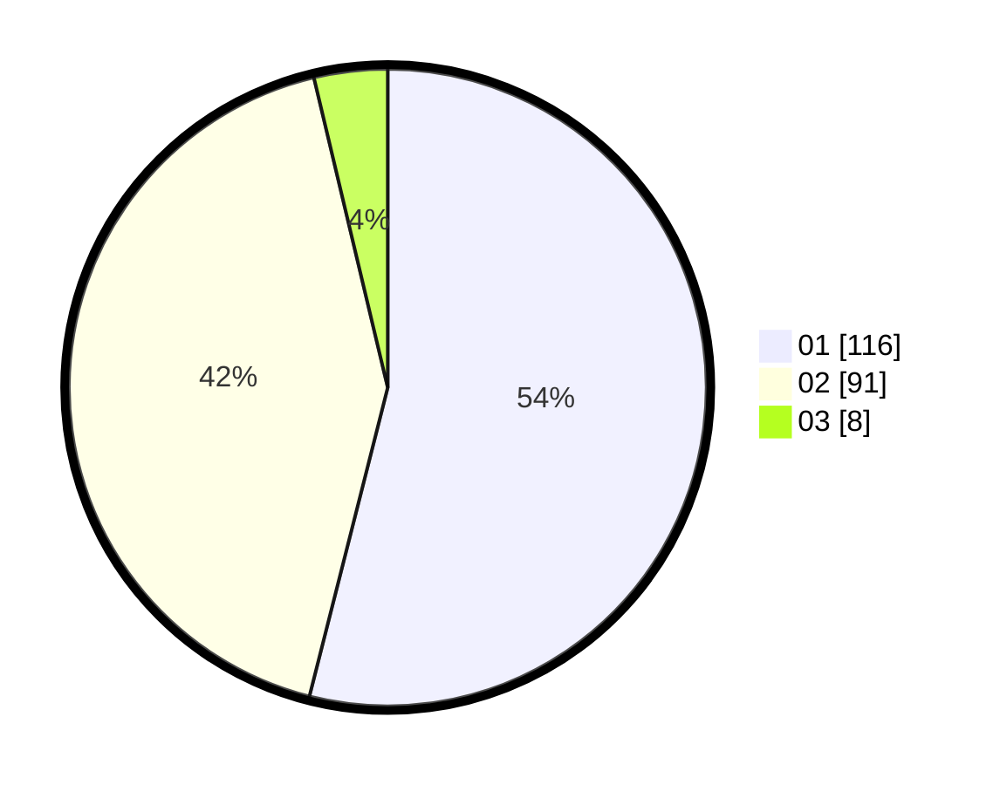

# Hasil

Hasil perolehan suara paslon dapat dilihat pada file paslon-01.txt, paslon-02.txt, dan paslon-03.txt.

Jika tidak ada, artinya data tersebut belum ada pada SIREKAP.

## Perolehan Suara

 * Paslon 01: **116**.
 * Paslon 02: **91**.
 * Paslon 03: **8**.

## Foto C Plano

https://sirekap-obj-formc.kpu.go.id/90d3/pemilu/ppwp/31/72/01/10/02/3172011002015-20240216-210305--7656ef09-2fb2-48bc-8c5f-559ff39e1ceb.jpg

https://sirekap-obj-formc.kpu.go.id/90d3/pemilu/ppwp/31/72/01/10/02/3172011002015-20240216-210351--a4ce8129-c9df-43a0-b582-debe1886e222.jpg

https://sirekap-obj-formc.kpu.go.id/90d3/pemilu/ppwp/31/72/01/10/02/3172011002015-20240216-210424--5a0b3a2b-4dd7-40df-8ab8-0c6f445fd013.jpg

## DATA PEMILIH TETAP

Jumlah pemilih dalam DPT: **244**.
 * L: **130**.
 * P: **114**.

## DATA PENGGUNA HAK PILIH

Jumlah pengguna hak pilih dalam DPT: **221**.
 * L: **120**.
 * P: **101**.

Jumlah pengguna hak pilih dalam DPTb: **1**.
 * L: **0**.
 * P: **1**.

Jumlah pengguna hak pilih dalam DPK: **2**.
 * L: **1**.
 * P: **1**.

Jumlah pengguna hak pilih: **224**.
 * L: **121**.
 * P: **103**.

## JUMLAH SUARA SAH DAN TIDAK SAH

JUMLAH SELURUH SUARA SAH: **215**.

JUMLAH SUARA TIDAK SAH: **9**.

JUMLAH SELURUH SUARA SAH DAN SUARA TIDAK SAH: **224**.
