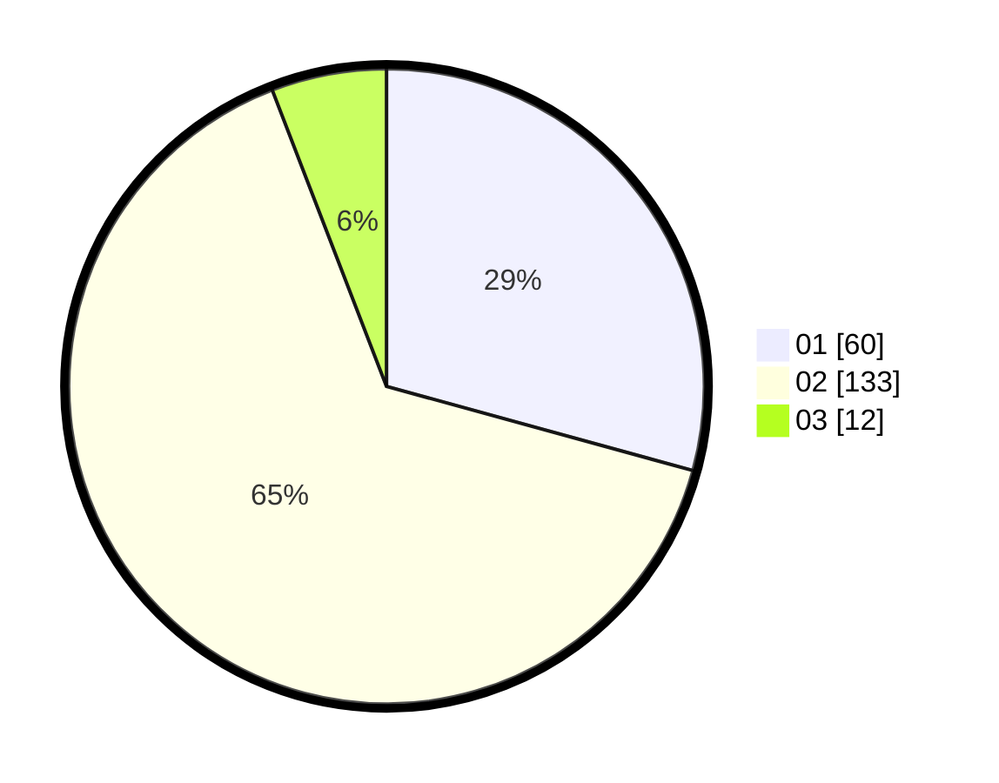

# Hasil

Hasil perolehan suara paslon dapat dilihat pada file paslon-01.txt, paslon-02.txt, dan paslon-03.txt.

Jika tidak ada, artinya data tersebut belum ada pada SIREKAP.

## Perolehan Suara

 * Paslon 01: **60**.
 * Paslon 02: **133**.
 * Paslon 03: **12**.

## Foto C Plano

https://sirekap-obj-formc.kpu.go.id/6b1d/pemilu/ppwp/31/72/01/10/02/3172011002017-20240216-211341--fd5f8b38-870c-4f3c-a09e-741af53a5f1f.jpg

https://sirekap-obj-formc.kpu.go.id/6b1d/pemilu/ppwp/31/72/01/10/02/3172011002017-20240216-211358--d63e7b9d-3083-4cea-889f-abb0d256d68c.jpg

https://sirekap-obj-formc.kpu.go.id/6b1d/pemilu/ppwp/31/72/01/10/02/3172011002017-20240216-211427--5ae6aaa1-c318-4379-84a3-5e05109fd111.jpg

## DATA PEMILIH TETAP

Jumlah pemilih dalam DPT: **248**.
 * L: **129**.
 * P: **119**.

## DATA PENGGUNA HAK PILIH

Jumlah pengguna hak pilih dalam DPT: **209**.
 * L: **106**.
 * P: **103**.

Jumlah pengguna hak pilih dalam DPTb: **2**.
 * L: **1**.
 * P: **1**.

Jumlah pengguna hak pilih dalam DPK: **3**.
 * L: **1**.
 * P: **2**.

Jumlah pengguna hak pilih: **214**.
 * L: **108**.
 * P: **105**.

## JUMLAH SUARA SAH DAN TIDAK SAH

JUMLAH SELURUH SUARA SAH: **205**.

JUMLAH SUARA TIDAK SAH: **9**.

JUMLAH SELURUH SUARA SAH DAN SUARA TIDAK SAH: **214**.
