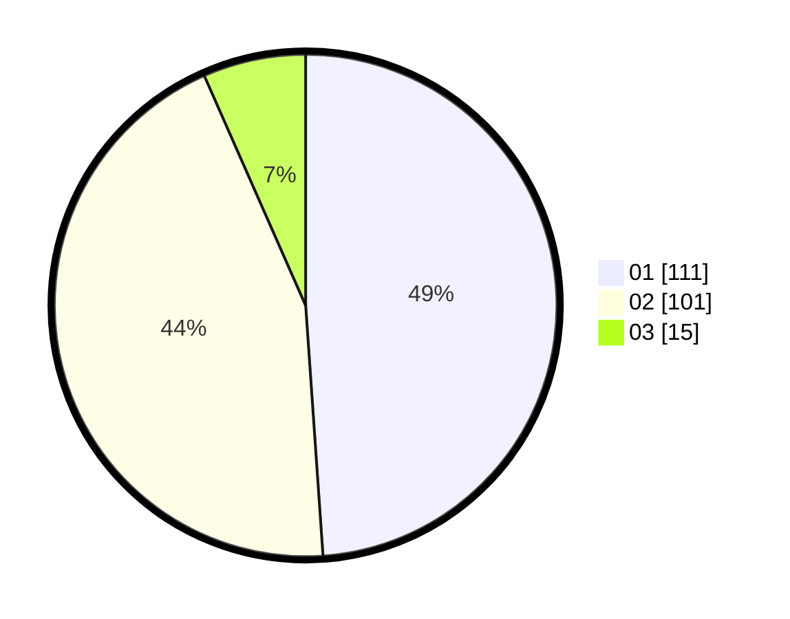

# Hasil

Hasil perolehan suara paslon dapat dilihat pada file paslon-01.txt, paslon-02.txt, dan paslon-03.txt.

Jika tidak ada, artinya data tersebut belum ada pada SIREKAP.

## Perolehan Suara

 * Paslon 01: **111**.
 * Paslon 02: **101**.
 * Paslon 03: **15**.

## Foto C Plano

https://sirekap-obj-formc.kpu.go.id/1596/pemilu/ppwp/31/72/01/10/02/3172011002020-20240217-101552--5e8ca682-e3a7-4aeb-9f03-880d595cb1fd.jpg

https://sirekap-obj-formc.kpu.go.id/1596/pemilu/ppwp/31/72/01/10/02/3172011002020-20240217-100837--e3c48770-16f6-400f-8da3-0da23147e183.jpg

https://sirekap-obj-formc.kpu.go.id/1596/pemilu/ppwp/31/72/01/10/02/3172011002020-20240217-100948--7571db89-25df-4246-adfe-1779a1110121.jpg

## DATA PEMILIH TETAP

Jumlah pemilih dalam DPT: **270**.
 * L: **139**.
 * P: **131**.

## DATA PENGGUNA HAK PILIH

Jumlah pengguna hak pilih dalam DPT: **235**.
 * L: **116**.
 * P: **119**.

Jumlah pengguna hak pilih dalam DPTb: **0**.
 * L: **0**.
 * P: **0**.

Jumlah pengguna hak pilih dalam DPK: **0**.
 * L: **0**.
 * P: **0**.

Jumlah pengguna hak pilih: **235**.
 * L: **116**.
 * P: **119**.

## JUMLAH SUARA SAH DAN TIDAK SAH

JUMLAH SELURUH SUARA SAH: **227**.

JUMLAH SUARA TIDAK SAH: **8**.

JUMLAH SELURUH SUARA SAH DAN SUARA TIDAK SAH: **235**.
