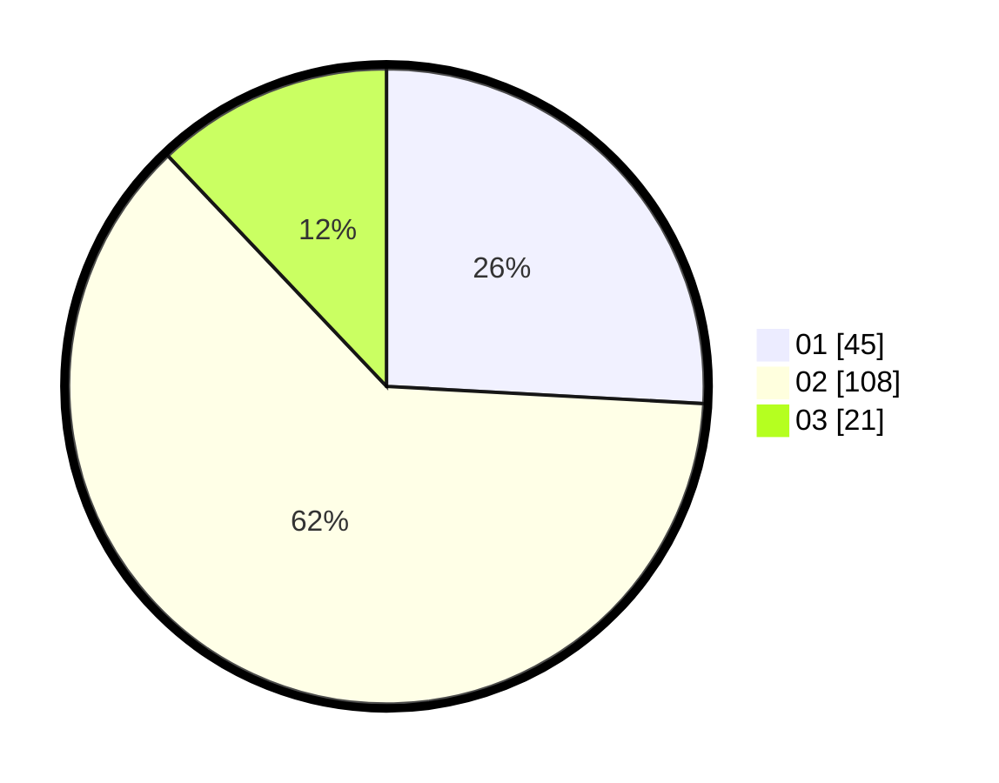

# Hasil

Hasil perolehan suara paslon dapat dilihat pada file paslon-01.txt, paslon-02.txt, dan paslon-03.txt.

Jika tidak ada, artinya data tersebut belum ada pada SIREKAP.

## Perolehan Suara

 * Paslon 01: **45**.
 * Paslon 02: **108**.
 * Paslon 03: **21**.

## Foto C Plano

https://sirekap-obj-formc.kpu.go.id/942d/pemilu/ppwp/31/72/01/10/02/3172011002022-20240217-103412--286d1c6a-36e4-410e-8147-884915dcb072.jpg

https://sirekap-obj-formc.kpu.go.id/942d/pemilu/ppwp/31/72/01/10/02/3172011002022-20240217-103457--6bba38c6-3aac-484c-aeba-dd93141a3f32.jpg

https://sirekap-obj-formc.kpu.go.id/942d/pemilu/ppwp/31/72/01/10/02/3172011002022-20240217-103536--ba1fb3f9-0f86-47f5-b975-2855c9cfe9fc.jpg

## DATA PEMILIH TETAP

Jumlah pemilih dalam DPT: **180**.
 * L: **91**.
 * P: **89**.

## DATA PENGGUNA HAK PILIH

Jumlah pengguna hak pilih dalam DPT: **180**.
 * L: **91**.
 * P: **89**.

Jumlah pengguna hak pilih dalam DPTb: **0**.
 * L: **0**.
 * P: **0**.

Jumlah pengguna hak pilih dalam DPK: **0**.
 * L: **0**.
 * P: **0**.

Jumlah pengguna hak pilih: **180**.
 * L: **91**.
 * P: **89**.

## JUMLAH SUARA SAH DAN TIDAK SAH

JUMLAH SELURUH SUARA SAH: **174**.

JUMLAH SUARA TIDAK SAH: **6**.

JUMLAH SELURUH SUARA SAH DAN SUARA TIDAK SAH: **180**.
