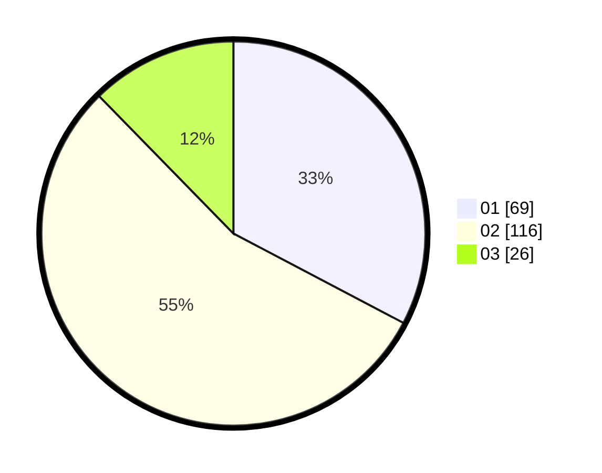

# Hasil

Hasil perolehan suara paslon dapat dilihat pada file paslon-01.txt, paslon-02.txt, dan paslon-03.txt.

Jika tidak ada, artinya data tersebut belum ada pada SIREKAP.

## Perolehan Suara

 * Paslon 01: **69**.
 * Paslon 02: **116**.
 * Paslon 03: **26**.

## Foto C Plano

https://sirekap-obj-formc.kpu.go.id/7ea6/pemilu/ppwp/31/72/01/10/02/3172011002030-20240217-143251--d91ecfc4-41c4-4f28-ab71-2fdf7e22107f.jpg

https://sirekap-obj-formc.kpu.go.id/7ea6/pemilu/ppwp/31/72/01/10/02/3172011002030-20240217-142805--344f0dc5-4455-45a5-b8dc-607c0defbd2b.jpg

https://sirekap-obj-formc.kpu.go.id/7ea6/pemilu/ppwp/31/72/01/10/02/3172011002030-20240217-142825--686f0ddf-c9cc-414b-947a-db5b89abf234.jpg

## DATA PEMILIH TETAP

Jumlah pemilih dalam DPT: **247**.
 * L: **123**.
 * P: **124**.

## DATA PENGGUNA HAK PILIH

Jumlah pengguna hak pilih dalam DPT: **199**.
 * L: **95**.
 * P: **104**.

Jumlah pengguna hak pilih dalam DPTb: **15**.
 * L: **11**.
 * P: **4**.

Jumlah pengguna hak pilih dalam DPK: **0**.
 * L: **0**.
 * P: **0**.

Jumlah pengguna hak pilih: **214**.
 * L: **106**.
 * P: **108**.

## JUMLAH SUARA SAH DAN TIDAK SAH

JUMLAH SELURUH SUARA SAH: **211**.

JUMLAH SUARA TIDAK SAH: **3**.

JUMLAH SELURUH SUARA SAH DAN SUARA TIDAK SAH: **214**.
