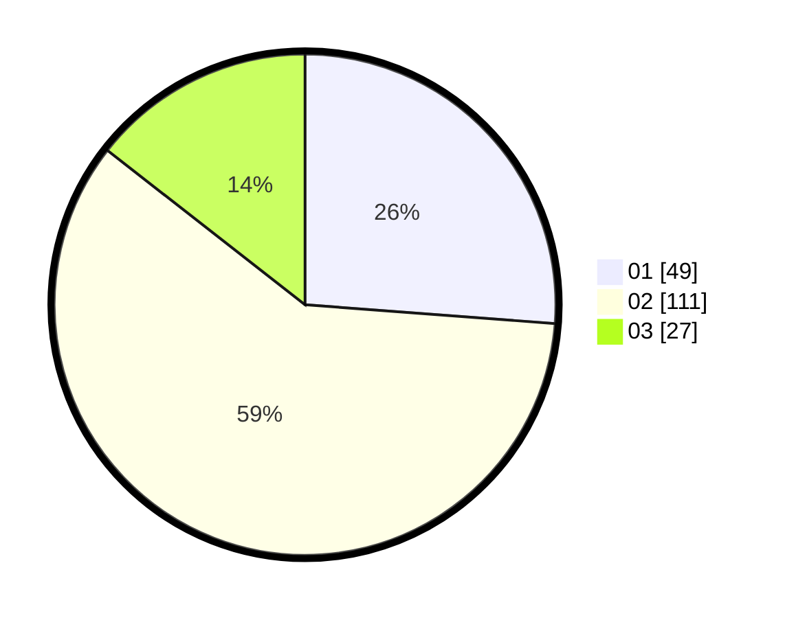

# Hasil

Hasil perolehan suara paslon dapat dilihat pada file paslon-01.txt, paslon-02.txt, dan paslon-03.txt.

Jika tidak ada, artinya data tersebut belum ada pada SIREKAP.

## Perolehan Suara

 * Paslon 01: **49**.
 * Paslon 02: **111**.
 * Paslon 03: **27**.

## Foto C Plano

https://sirekap-obj-formc.kpu.go.id/5e5a/pemilu/ppwp/31/72/01/10/02/3172011002033-20240217-150702--a27a5428-e4bb-4e28-adbd-63e2f5362ae0.jpg

https://sirekap-obj-formc.kpu.go.id/5e5a/pemilu/ppwp/31/72/01/10/02/3172011002033-20240217-150509--10eb470d-6a57-4f94-a651-a624244e63e8.jpg

https://sirekap-obj-formc.kpu.go.id/5e5a/pemilu/ppwp/31/72/01/10/02/3172011002033-20240217-150754--56042612-3189-48fe-b1d4-98fef063a427.jpg

## DATA PEMILIH TETAP

Jumlah pemilih dalam DPT: **254**.
 * L: **136**.
 * P: **118**.

## DATA PENGGUNA HAK PILIH

Jumlah pengguna hak pilih dalam DPT: **174**.
 * L: **92**.
 * P: **82**.

Jumlah pengguna hak pilih dalam DPTb: **11**.
 * L: **5**.
 * P: **6**.

Jumlah pengguna hak pilih dalam DPK: **4**.
 * L: **3**.
 * P: **1**.

Jumlah pengguna hak pilih: **189**.
 * L: **100**.
 * P: **89**.

## JUMLAH SUARA SAH DAN TIDAK SAH

JUMLAH SELURUH SUARA SAH: **187**.

JUMLAH SUARA TIDAK SAH: **2**.

JUMLAH SELURUH SUARA SAH DAN SUARA TIDAK SAH: **189**.
