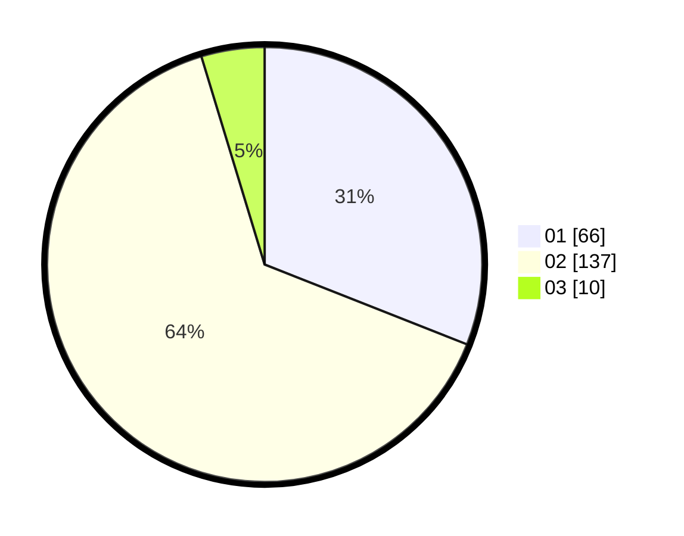

# Hasil

Hasil perolehan suara paslon dapat dilihat pada file paslon-01.txt, paslon-02.txt, dan paslon-03.txt.

Jika tidak ada, artinya data tersebut belum ada pada SIREKAP.

## Perolehan Suara

 * Paslon 01: **66**.
 * Paslon 02: **137**.
 * Paslon 03: **10**.

## Foto C Plano

https://sirekap-obj-formc.kpu.go.id/a06a/pemilu/ppwp/31/72/01/10/03/3172011003002-20240216-140746--a06ebd18-1807-484a-90cc-955f4db44965.jpg

https://sirekap-obj-formc.kpu.go.id/a06a/pemilu/ppwp/31/72/01/10/03/3172011003002-20240216-140832--8900ecc8-4cf8-468a-8c7b-fe9bc5401e6a.jpg

https://sirekap-obj-formc.kpu.go.id/a06a/pemilu/ppwp/31/72/01/10/03/3172011003002-20240216-140934--4a8a50e4-1546-4710-bf03-bcba95ba52d7.jpg

## DATA PEMILIH TETAP

Jumlah pemilih dalam DPT: **286**.
 * L: **146**.
 * P: **140**.

## DATA PENGGUNA HAK PILIH

Jumlah pengguna hak pilih dalam DPT: **216**.
 * L: **104**.
 * P: **112**.

Jumlah pengguna hak pilih dalam DPTb: **2**.
 * L: **1**.
 * P: **1**.

Jumlah pengguna hak pilih dalam DPK: **0**.
 * L: **0**.
 * P: **0**.

Jumlah pengguna hak pilih: **218**.
 * L: **105**.
 * P: **113**.

## JUMLAH SUARA SAH DAN TIDAK SAH

JUMLAH SELURUH SUARA SAH: **213**.

JUMLAH SUARA TIDAK SAH: **5**.

JUMLAH SELURUH SUARA SAH DAN SUARA TIDAK SAH: **218**.
