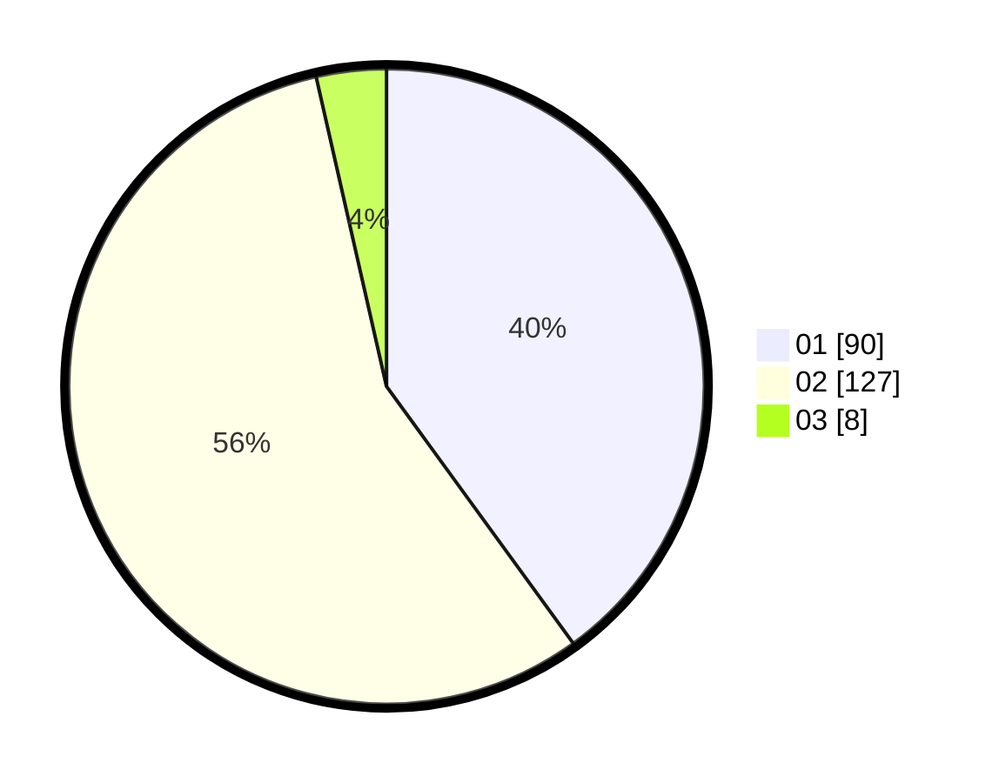

# Hasil

Hasil perolehan suara paslon dapat dilihat pada file paslon-01.txt, paslon-02.txt, dan paslon-03.txt.

Jika tidak ada, artinya data tersebut belum ada pada SIREKAP.

## Perolehan Suara

 * Paslon 01: **90**.
 * Paslon 02: **127**.
 * Paslon 03: **8**.

## Foto C Plano

https://sirekap-obj-formc.kpu.go.id/eebf/pemilu/ppwp/31/72/01/10/03/3172011003005-20240216-150019--5d4dcd68-31af-47f4-b8b1-4794a0f67ea0.jpg

https://sirekap-obj-formc.kpu.go.id/eebf/pemilu/ppwp/31/72/01/10/03/3172011003005-20240216-155023--dd12e2b0-ab2b-4cd7-a404-cfd8e4bd38e9.jpg

https://sirekap-obj-formc.kpu.go.id/eebf/pemilu/ppwp/31/72/01/10/03/3172011003005-20240216-150221--468aae3f-4415-4495-8b52-6e298b257fba.jpg

## DATA PEMILIH TETAP

Jumlah pemilih dalam DPT: **287**.
 * L: **152**.
 * P: **135**.

## DATA PENGGUNA HAK PILIH

Jumlah pengguna hak pilih dalam DPT: **222**.
 * L: **113**.
 * P: **109**.

Jumlah pengguna hak pilih dalam DPTb: **1**.
 * L: **1**.
 * P: **0**.

Jumlah pengguna hak pilih dalam DPK: **5**.
 * L: **2**.
 * P: **3**.

Jumlah pengguna hak pilih: **228**.
 * L: **116**.
 * P: **112**.

## JUMLAH SUARA SAH DAN TIDAK SAH

JUMLAH SELURUH SUARA SAH: **225**.

JUMLAH SUARA TIDAK SAH: **3**.

JUMLAH SELURUH SUARA SAH DAN SUARA TIDAK SAH: **228**.
