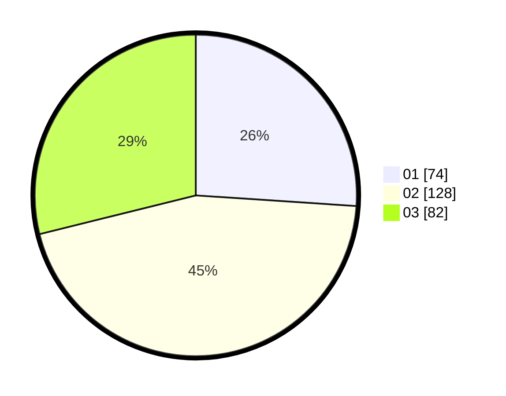

# Hasil

Hasil perolehan suara paslon dapat dilihat pada file paslon-01.txt, paslon-02.txt, dan paslon-03.txt.

Jika tidak ada, artinya data tersebut belum ada pada SIREKAP.

## Perolehan Suara

 * Paslon 01: **74**.
 * Paslon 02: **128**.
 * Paslon 03: **82**.

## Foto C Plano

https://sirekap-obj-formc.kpu.go.id/cde5/pemilu/ppwp/31/72/01/10/03/3172011003006-20240216-151000--39cec29a-ecbf-4d6f-8479-ba10c393efe5.jpg

https://sirekap-obj-formc.kpu.go.id/cde5/pemilu/ppwp/31/72/01/10/03/3172011003006-20240216-150801--31ea8daf-ac6d-420b-a358-af4ce76b2640.jpg

https://sirekap-obj-formc.kpu.go.id/cde5/pemilu/ppwp/31/72/01/10/03/3172011003006-20240216-150844--933ad923-d518-4ee2-8a7f-c285efa47be0.jpg

## DATA PEMILIH TETAP

Jumlah pemilih dalam DPT: **280**.
 * L: **153**.
 * P: **127**.

## DATA PENGGUNA HAK PILIH

Jumlah pengguna hak pilih dalam DPT: **207**.
 * L: **105**.
 * P: **102**.

Jumlah pengguna hak pilih dalam DPTb: **4**.
 * L: **1**.
 * P: **3**.

Jumlah pengguna hak pilih dalam DPK: **1**.
 * L: **1**.
 * P: **0**.

Jumlah pengguna hak pilih: **212**.
 * L: **109**.
 * P: **103**.

## JUMLAH SUARA SAH DAN TIDAK SAH

JUMLAH SELURUH SUARA SAH: **209**.

JUMLAH SUARA TIDAK SAH: **3**.

JUMLAH SELURUH SUARA SAH DAN SUARA TIDAK SAH: **212**.
