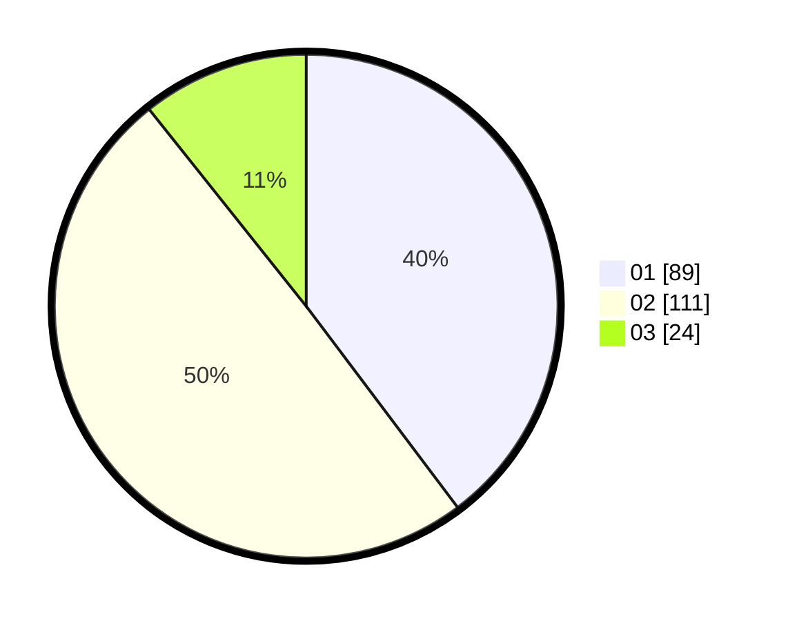

# Hasil

Hasil perolehan suara paslon dapat dilihat pada file paslon-01.txt, paslon-02.txt, dan paslon-03.txt.

Jika tidak ada, artinya data tersebut belum ada pada SIREKAP.

## Perolehan Suara

 * Paslon 01: **89**.
 * Paslon 02: **111**.
 * Paslon 03: **24**.

## Foto C Plano

https://sirekap-obj-formc.kpu.go.id/13c8/pemilu/ppwp/31/72/01/10/03/3172011003011-20240216-164609--c1806bb9-1fbe-4e8d-a7a5-abb33cf52ee1.jpg

https://sirekap-obj-formc.kpu.go.id/13c8/pemilu/ppwp/31/72/01/10/03/3172011003011-20240216-164700--b6117a7b-d78e-4569-8551-676f9fc380c8.jpg

https://sirekap-obj-formc.kpu.go.id/13c8/pemilu/ppwp/31/72/01/10/03/3172011003011-20240216-164720--8e216379-88cf-4f53-a9f3-8867be6df8ff.jpg

## DATA PEMILIH TETAP

Jumlah pemilih dalam DPT: **291**.
 * L: **160**.
 * P: **131**.

## DATA PENGGUNA HAK PILIH

Jumlah pengguna hak pilih dalam DPT: **220**.
 * L: **118**.
 * P: **102**.

Jumlah pengguna hak pilih dalam DPTb: **1**.
 * L: **1**.
 * P: **0**.

Jumlah pengguna hak pilih dalam DPK: **3**.
 * L: **1**.
 * P: **2**.

Jumlah pengguna hak pilih: **224**.
 * L: **120**.
 * P: **104**.

## JUMLAH SUARA SAH DAN TIDAK SAH

JUMLAH SELURUH SUARA SAH: **224**.

JUMLAH SUARA TIDAK SAH: **0**.

JUMLAH SELURUH SUARA SAH DAN SUARA TIDAK SAH: **224**.
