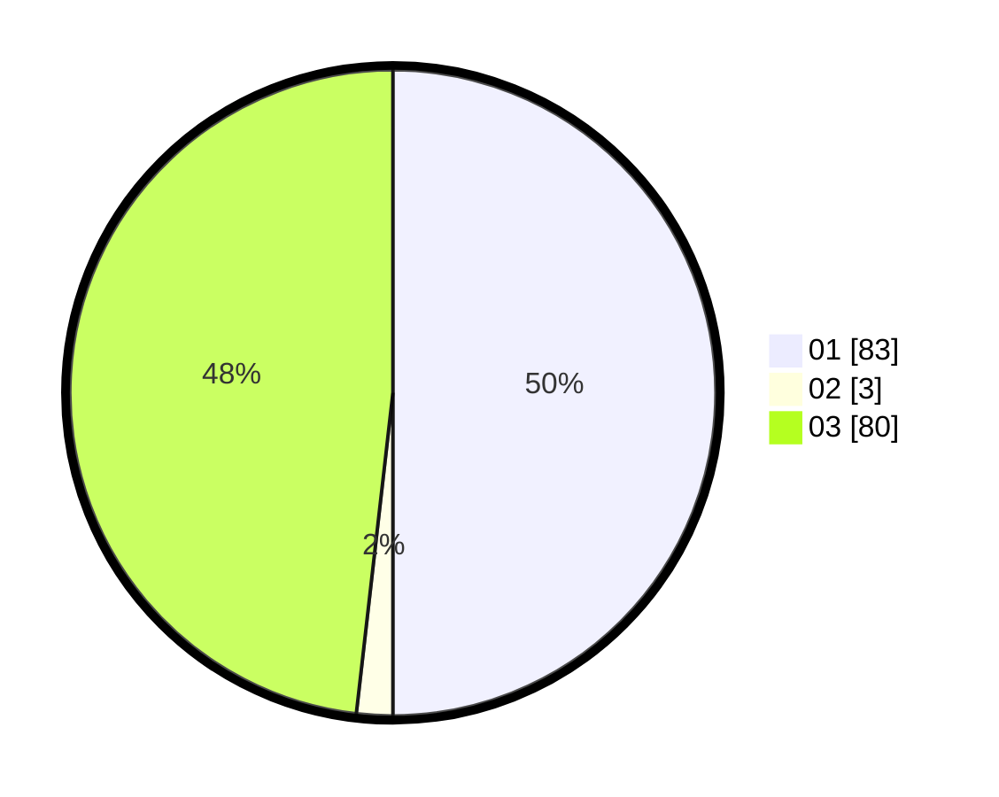

# Hasil

Hasil perolehan suara paslon dapat dilihat pada file paslon-01.txt, paslon-02.txt, dan paslon-03.txt.

Jika tidak ada, artinya data tersebut belum ada pada SIREKAP.

## Perolehan Suara

 * Paslon 01: **83**.
 * Paslon 02: **3**.
 * Paslon 03: **80**.

## Foto C Plano

https://sirekap-obj-formc.kpu.go.id/f487/pemilu/ppwp/31/72/01/10/03/3172011003012-20240216-165319--473dbb52-f22f-4e37-92a7-20e1a3ec5d38.jpg

https://sirekap-obj-formc.kpu.go.id/f487/pemilu/ppwp/31/72/01/10/03/3172011003012-20240216-165342--7c359dbb-7155-4b71-a603-53ed674f6086.jpg

https://sirekap-obj-formc.kpu.go.id/f487/pemilu/ppwp/31/72/01/10/03/3172011003012-20240216-165410--4406e068-0cbe-4e0e-81ab-1ec6b6bdd3af.jpg

## DATA PEMILIH TETAP

Jumlah pemilih dalam DPT: **289**.
 * L: **145**.
 * P: **144**.

## DATA PENGGUNA HAK PILIH

Jumlah pengguna hak pilih dalam DPT: **209**.
 * L: **103**.
 * P: **106**.

Jumlah pengguna hak pilih dalam DPTb: **0**.
 * L: **0**.
 * P: **0**.

Jumlah pengguna hak pilih dalam DPK: **0**.
 * L: **0**.
 * P: **0**.

Jumlah pengguna hak pilih: **209**.
 * L: **103**.
 * P: **106**.

## JUMLAH SUARA SAH DAN TIDAK SAH

JUMLAH SELURUH SUARA SAH: **206**.

JUMLAH SUARA TIDAK SAH: **3**.

JUMLAH SELURUH SUARA SAH DAN SUARA TIDAK SAH: **209**.
