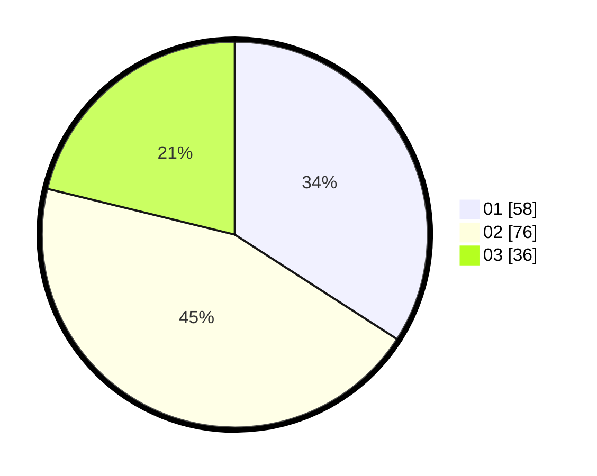

# Hasil

Hasil perolehan suara paslon dapat dilihat pada file paslon-01.txt, paslon-02.txt, dan paslon-03.txt.

Jika tidak ada, artinya data tersebut belum ada pada SIREKAP.

## Perolehan Suara

 * Paslon 01: **58**.
 * Paslon 02: **76**.
 * Paslon 03: **36**.

## Foto C Plano

https://sirekap-obj-formc.kpu.go.id/0580/pemilu/ppwp/31/72/01/10/03/3172011003013-20240216-165704--44d8487f-4a9c-41fd-b511-5510666935fd.jpg

https://sirekap-obj-formc.kpu.go.id/0580/pemilu/ppwp/31/72/01/10/03/3172011003013-20240216-165739--bdad12b9-2291-4480-8952-8a242121038d.jpg

https://sirekap-obj-formc.kpu.go.id/0580/pemilu/ppwp/31/72/01/10/03/3172011003013-20240216-165813--29b51bd2-98b0-425b-a2cb-368a6b641a6d.jpg

## DATA PEMILIH TETAP

Jumlah pemilih dalam DPT: **234**.
 * L: **124**.
 * P: **110**.

## DATA PENGGUNA HAK PILIH

Jumlah pengguna hak pilih dalam DPT: **172**.
 * L: **91**.
 * P: **81**.

Jumlah pengguna hak pilih dalam DPTb: **1**.
 * L: **0**.
 * P: **1**.

Jumlah pengguna hak pilih dalam DPK: **0**.
 * L: **0**.
 * P: **0**.

Jumlah pengguna hak pilih: **173**.
 * L: **91**.
 * P: **82**.

## JUMLAH SUARA SAH DAN TIDAK SAH

JUMLAH SELURUH SUARA SAH: **170**.

JUMLAH SUARA TIDAK SAH: **3**.

JUMLAH SELURUH SUARA SAH DAN SUARA TIDAK SAH: **173**.
