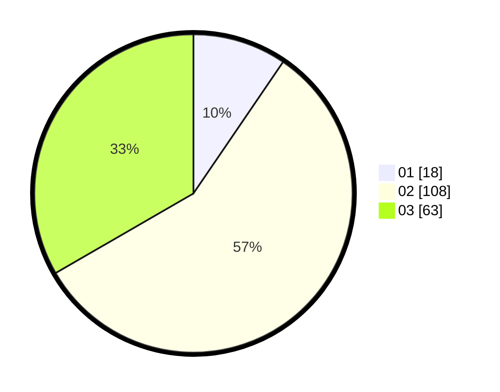

# Hasil

Hasil perolehan suara paslon dapat dilihat pada file paslon-01.txt, paslon-02.txt, dan paslon-03.txt.

Jika tidak ada, artinya data tersebut belum ada pada SIREKAP.

## Perolehan Suara

 * Paslon 01: **18**.
 * Paslon 02: **108**.
 * Paslon 03: **63**.

## Foto C Plano

https://sirekap-obj-formc.kpu.go.id/3901/pemilu/ppwp/31/72/01/10/03/3172011003015-20240216-170411--dbcb155d-ee43-459d-9142-642a643c0aa8.jpg

https://sirekap-obj-formc.kpu.go.id/3901/pemilu/ppwp/31/72/01/10/03/3172011003015-20240216-170433--af1a3b79-dcb5-4535-b228-506c78829c9d.jpg

https://sirekap-obj-formc.kpu.go.id/3901/pemilu/ppwp/31/72/01/10/03/3172011003015-20240216-170456--de56e35b-1927-48c6-ae59-d1bb5e6b23ad.jpg

## DATA PEMILIH TETAP

Jumlah pemilih dalam DPT: **290**.
 * L: **151**.
 * P: **139**.

## DATA PENGGUNA HAK PILIH

Jumlah pengguna hak pilih dalam DPT: **181**.
 * L: **92**.
 * P: **89**.

Jumlah pengguna hak pilih dalam DPTb: **10**.
 * L: **0**.
 * P: **10**.

Jumlah pengguna hak pilih dalam DPK: **2**.
 * L: **0**.
 * P: **2**.

Jumlah pengguna hak pilih: **193**.
 * L: **92**.
 * P: **101**.

## JUMLAH SUARA SAH DAN TIDAK SAH

JUMLAH SELURUH SUARA SAH: **189**.

JUMLAH SUARA TIDAK SAH: **4**.

JUMLAH SELURUH SUARA SAH DAN SUARA TIDAK SAH: **193**.
