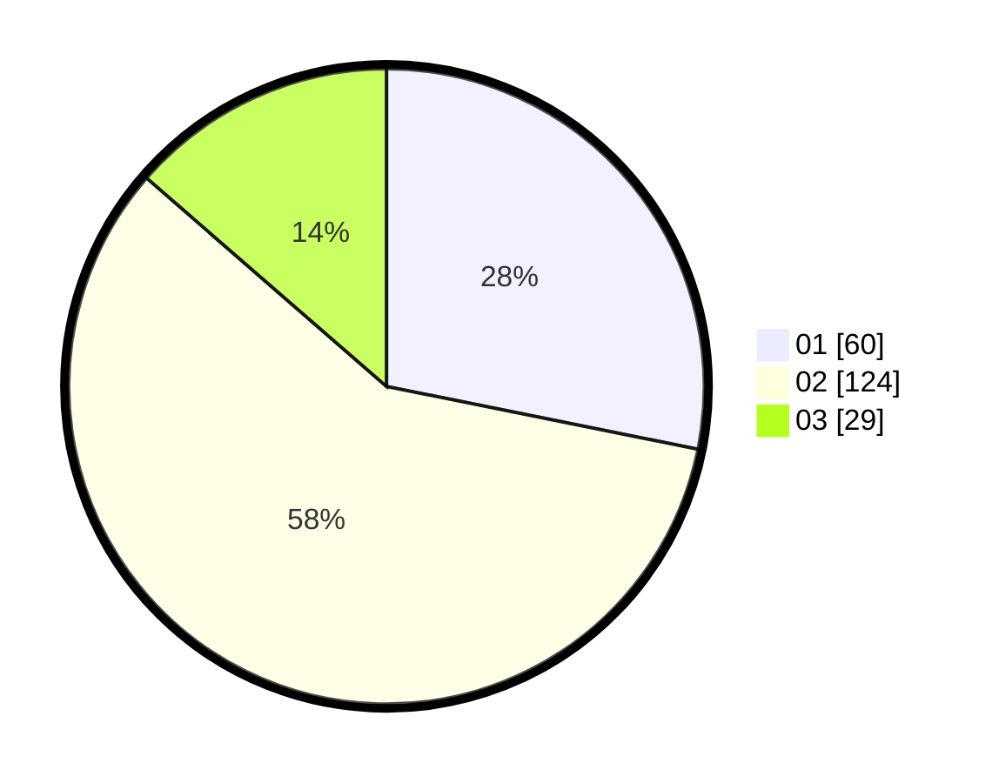

# Hasil

Hasil perolehan suara paslon dapat dilihat pada file paslon-01.txt, paslon-02.txt, dan paslon-03.txt.

Jika tidak ada, artinya data tersebut belum ada pada SIREKAP.

## Perolehan Suara

 * Paslon 01: **60**.
 * Paslon 02: **124**.
 * Paslon 03: **29**.

## Foto C Plano

https://sirekap-obj-formc.kpu.go.id/3dc5/pemilu/ppwp/31/72/01/10/03/3172011003018-20240216-171102--c2eb61ea-a311-494c-80e0-f604c5341eed.jpg

https://sirekap-obj-formc.kpu.go.id/3dc5/pemilu/ppwp/31/72/01/10/03/3172011003018-20240216-171139--607d7210-cbe9-4031-9159-fdd691689e8e.jpg

https://sirekap-obj-formc.kpu.go.id/3dc5/pemilu/ppwp/31/72/01/10/03/3172011003018-20240216-171223--18040e67-3ccf-48f8-a0fb-208e33e7d424.jpg

## DATA PEMILIH TETAP

Jumlah pemilih dalam DPT: **294**.
 * L: **149**.
 * P: **145**.

## DATA PENGGUNA HAK PILIH

Jumlah pengguna hak pilih dalam DPT: **206**.
 * L: **95**.
 * P: **111**.

Jumlah pengguna hak pilih dalam DPTb: **6**.
 * L: **3**.
 * P: **3**.

Jumlah pengguna hak pilih dalam DPK: **2**.
 * L: **2**.
 * P: **0**.

Jumlah pengguna hak pilih: **214**.
 * L: **100**.
 * P: **114**.

## JUMLAH SUARA SAH DAN TIDAK SAH

JUMLAH SELURUH SUARA SAH: **213**.

JUMLAH SUARA TIDAK SAH: **1**.

JUMLAH SELURUH SUARA SAH DAN SUARA TIDAK SAH: **214**.
