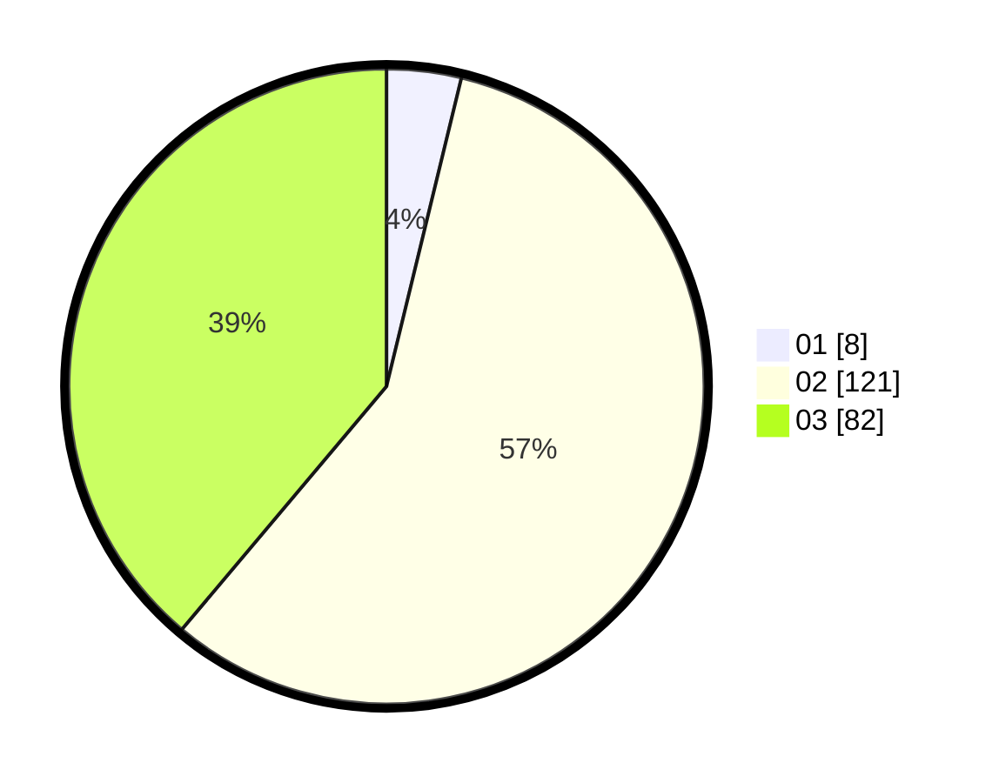

# Hasil

Hasil perolehan suara paslon dapat dilihat pada file paslon-01.txt, paslon-02.txt, dan paslon-03.txt.

Jika tidak ada, artinya data tersebut belum ada pada SIREKAP.

## Perolehan Suara

 * Paslon 01: **8**.
 * Paslon 02: **121**.
 * Paslon 03: **82**.

## Foto C Plano

https://sirekap-obj-formc.kpu.go.id/a7e6/pemilu/ppwp/31/72/01/10/03/3172011003019-20240216-171335--088c52a9-3ce8-4809-9141-67f4099e8d7b.jpg

https://sirekap-obj-formc.kpu.go.id/a7e6/pemilu/ppwp/31/72/01/10/03/3172011003019-20240216-171353--b7e0404d-09ff-4ab9-96cf-f4d214a99566.jpg

https://sirekap-obj-formc.kpu.go.id/a7e6/pemilu/ppwp/31/72/01/10/03/3172011003019-20240216-174356--2fff5fd3-f918-4387-9e39-818672fbfee9.jpg

## DATA PEMILIH TETAP

Jumlah pemilih dalam DPT: **288**.
 * L: **133**.
 * P: **155**.

## DATA PENGGUNA HAK PILIH

Jumlah pengguna hak pilih dalam DPT: **200**.
 * L: **94**.
 * P: **106**.

Jumlah pengguna hak pilih dalam DPTb: **11**.
 * L: **2**.
 * P: **9**.

Jumlah pengguna hak pilih dalam DPK: **3**.
 * L: **0**.
 * P: **3**.

Jumlah pengguna hak pilih: **214**.
 * L: **96**.
 * P: **118**.

## JUMLAH SUARA SAH DAN TIDAK SAH

JUMLAH SELURUH SUARA SAH: **211**.

JUMLAH SUARA TIDAK SAH: **3**.

JUMLAH SELURUH SUARA SAH DAN SUARA TIDAK SAH: **214**.
