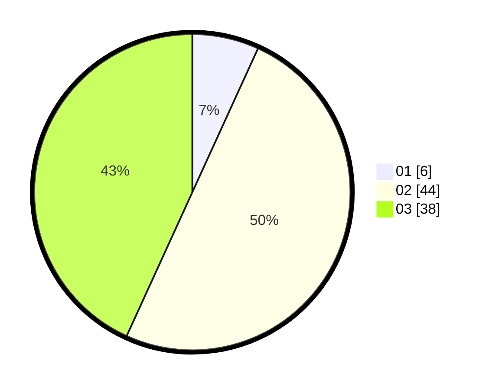

# Hasil

Hasil perolehan suara paslon dapat dilihat pada file paslon-01.txt, paslon-02.txt, dan paslon-03.txt.

Jika tidak ada, artinya data tersebut belum ada pada SIREKAP.

## Perolehan Suara

 * Paslon 01: **6**.
 * Paslon 02: **44**.
 * Paslon 03: **38**.

## Foto C Plano

https://sirekap-obj-formc.kpu.go.id/8fd8/pemilu/ppwp/31/72/01/10/03/3172011003020-20240216-171505--44578174-b125-40e7-b0f9-7a28184ef8b7.jpg

https://sirekap-obj-formc.kpu.go.id/8fd8/pemilu/ppwp/31/72/01/10/03/3172011003020-20240216-171526--daf4647d-fd25-46df-bbb8-d5e0abcaf4f3.jpg

https://sirekap-obj-formc.kpu.go.id/8fd8/pemilu/ppwp/31/72/01/10/03/3172011003020-20240216-171540--14bee005-7e2e-4bc3-a3c3-c2510796ee1a.jpg

## DATA PEMILIH TETAP

Jumlah pemilih dalam DPT: **292**.
 * L: **134**.
 * P: **158**.

## DATA PENGGUNA HAK PILIH

Jumlah pengguna hak pilih dalam DPT: **207**.
 * L: **94**.
 * P: **113**.

Jumlah pengguna hak pilih dalam DPTb: **10**.
 * L: **1**.
 * P: **9**.

Jumlah pengguna hak pilih dalam DPK: **7**.
 * L: **4**.
 * P: **3**.

Jumlah pengguna hak pilih: **224**.
 * L: **99**.
 * P: **125**.

## JUMLAH SUARA SAH DAN TIDAK SAH

JUMLAH SELURUH SUARA SAH: **218**.

JUMLAH SUARA TIDAK SAH: **8**.

JUMLAH SELURUH SUARA SAH DAN SUARA TIDAK SAH: **226**.
