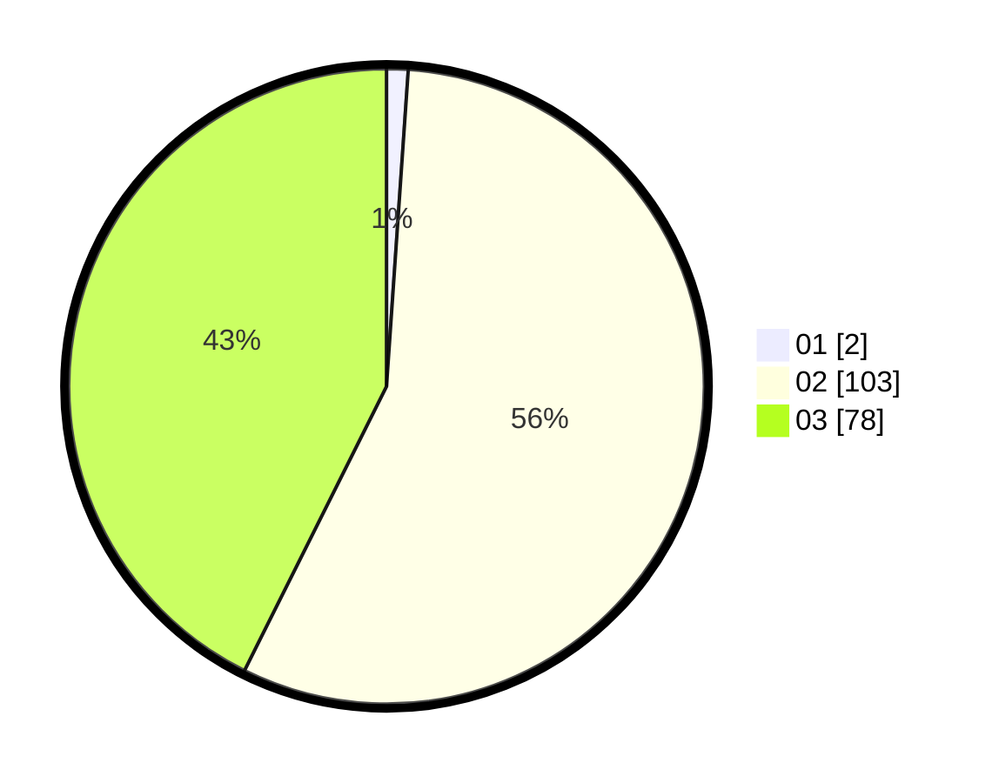

# Hasil

Hasil perolehan suara paslon dapat dilihat pada file paslon-01.txt, paslon-02.txt, dan paslon-03.txt.

Jika tidak ada, artinya data tersebut belum ada pada SIREKAP.

## Perolehan Suara

 * Paslon 01: **2**.
 * Paslon 02: **103**.
 * Paslon 03: **78**.

## Foto C Plano

https://sirekap-obj-formc.kpu.go.id/dd5e/pemilu/ppwp/31/72/01/10/03/3172011003022-20240216-180215--6b77907f-5b8b-46ed-8e83-ad5b3fc20d8c.jpg

https://sirekap-obj-formc.kpu.go.id/dd5e/pemilu/ppwp/31/72/01/10/03/3172011003022-20240216-180237--471f7424-a921-4e14-b8dd-ec1e92a5ee35.jpg

https://sirekap-obj-formc.kpu.go.id/dd5e/pemilu/ppwp/31/72/01/10/03/3172011003022-20240216-180256--2d654e77-e7cf-4b41-ac03-0293ab5bdc52.jpg

## DATA PEMILIH TETAP

Jumlah pemilih dalam DPT: **293**.
 * L: **140**.
 * P: **153**.

## DATA PENGGUNA HAK PILIH

Jumlah pengguna hak pilih dalam DPT: **175**.
 * L: **89**.
 * P: **86**.

Jumlah pengguna hak pilih dalam DPTb: **10**.
 * L: **4**.
 * P: **6**.

Jumlah pengguna hak pilih dalam DPK: **0**.
 * L: **0**.
 * P: **0**.

Jumlah pengguna hak pilih: **185**.
 * L: **93**.
 * P: **92**.

## JUMLAH SUARA SAH DAN TIDAK SAH

JUMLAH SELURUH SUARA SAH: **183**.

JUMLAH SUARA TIDAK SAH: **2**.

JUMLAH SELURUH SUARA SAH DAN SUARA TIDAK SAH: **185**.
