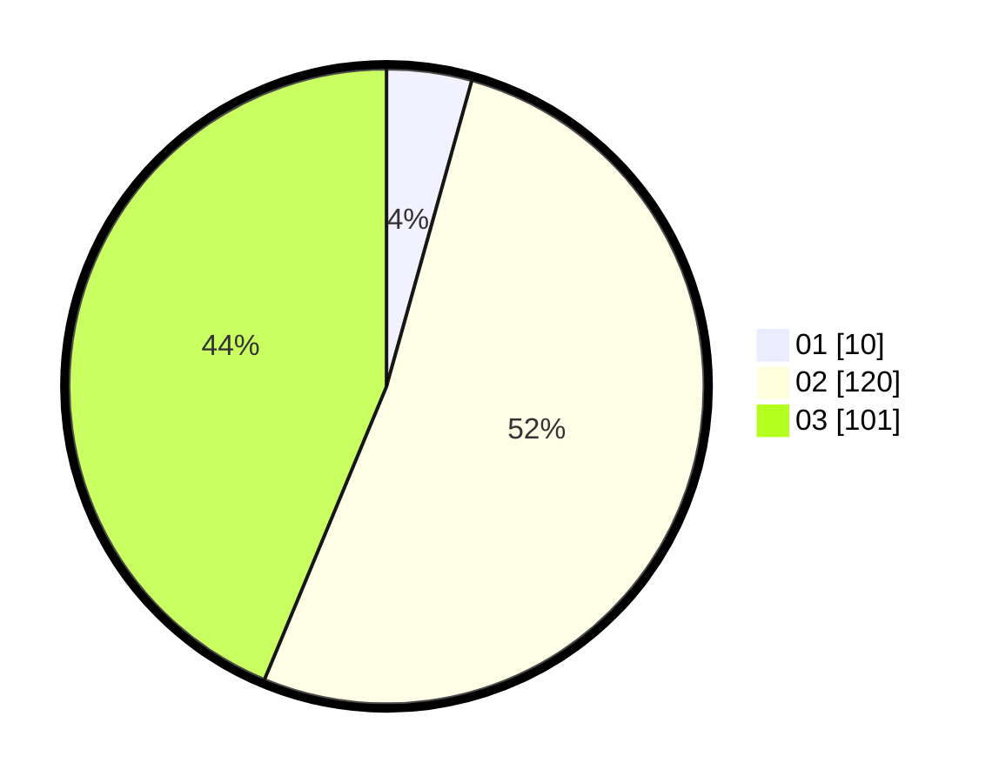

# Hasil

Hasil perolehan suara paslon dapat dilihat pada file paslon-01.txt, paslon-02.txt, dan paslon-03.txt.

Jika tidak ada, artinya data tersebut belum ada pada SIREKAP.

## Perolehan Suara

 * Paslon 01: **10**.
 * Paslon 02: **120**.
 * Paslon 03: **101**.

## Foto C Plano

https://sirekap-obj-formc.kpu.go.id/25ca/pemilu/ppwp/31/72/01/10/03/3172011003023-20240216-180459--90c6d016-2cf5-44ea-8c6b-3fe897ad1bf4.jpg

https://sirekap-obj-formc.kpu.go.id/25ca/pemilu/ppwp/31/72/01/10/03/3172011003023-20240216-180529--dde2ac0e-980d-4df2-a96b-f927e6b3399a.jpg

https://sirekap-obj-formc.kpu.go.id/25ca/pemilu/ppwp/31/72/01/10/03/3172011003023-20240216-180549--881b040d-3434-4807-909a-e535be14cf01.jpg

## DATA PEMILIH TETAP

Jumlah pemilih dalam DPT: **294**.
 * L: **154**.
 * P: **140**.

## DATA PENGGUNA HAK PILIH

Jumlah pengguna hak pilih dalam DPT: **216**.
 * L: **113**.
 * P: **103**.

Jumlah pengguna hak pilih dalam DPTb: **14**.
 * L: **7**.
 * P: **7**.

Jumlah pengguna hak pilih dalam DPK: **6**.
 * L: **2**.
 * P: **4**.

Jumlah pengguna hak pilih: **236**.
 * L: **122**.
 * P: **114**.

## JUMLAH SUARA SAH DAN TIDAK SAH

JUMLAH SELURUH SUARA SAH: **231**.

JUMLAH SUARA TIDAK SAH: **5**.

JUMLAH SELURUH SUARA SAH DAN SUARA TIDAK SAH: **236**.
