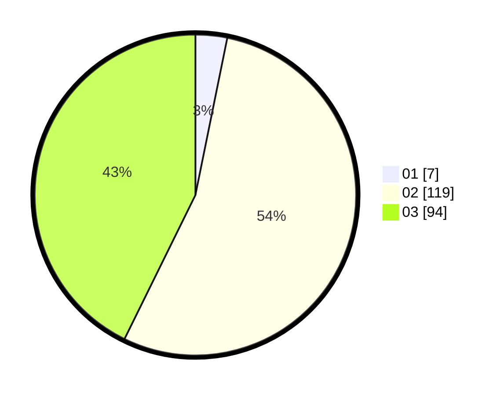

# Hasil

Hasil perolehan suara paslon dapat dilihat pada file paslon-01.txt, paslon-02.txt, dan paslon-03.txt.

Jika tidak ada, artinya data tersebut belum ada pada SIREKAP.

## Perolehan Suara

 * Paslon 01: **7**.
 * Paslon 02: **119**.
 * Paslon 03: **94**.

## Foto C Plano

https://sirekap-obj-formc.kpu.go.id/a034/pemilu/ppwp/31/72/01/10/03/3172011003024-20240216-180737--654cc559-4b56-4412-bb31-c5311613c456.jpg

https://sirekap-obj-formc.kpu.go.id/a034/pemilu/ppwp/31/72/01/10/03/3172011003024-20240216-180909--efbefd28-c79f-453f-8f55-f62714d563e2.jpg

https://sirekap-obj-formc.kpu.go.id/a034/pemilu/ppwp/31/72/01/10/03/3172011003024-20240216-180926--3c2f4964-4a9a-4186-9df0-d162b92d3198.jpg

## DATA PEMILIH TETAP

Jumlah pemilih dalam DPT: **293**.
 * L: **147**.
 * P: **146**.

## DATA PENGGUNA HAK PILIH

Jumlah pengguna hak pilih dalam DPT: **203**.
 * L: **102**.
 * P: **101**.

Jumlah pengguna hak pilih dalam DPTb: **15**.
 * L: **6**.
 * P: **9**.

Jumlah pengguna hak pilih dalam DPK: **6**.
 * L: **2**.
 * P: **4**.

Jumlah pengguna hak pilih: **224**.
 * L: **110**.
 * P: **114**.

## JUMLAH SUARA SAH DAN TIDAK SAH

JUMLAH SELURUH SUARA SAH: **220**.

JUMLAH SUARA TIDAK SAH: **4**.

JUMLAH SELURUH SUARA SAH DAN SUARA TIDAK SAH: **224**.
