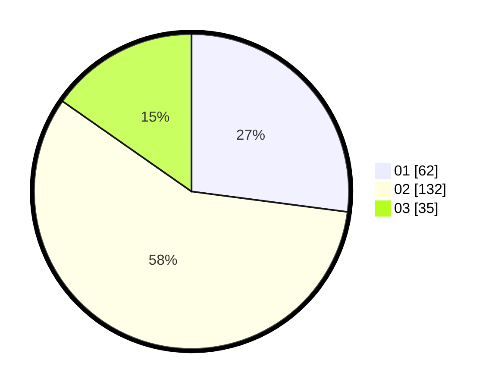

# Hasil

Hasil perolehan suara paslon dapat dilihat pada file paslon-01.txt, paslon-02.txt, dan paslon-03.txt.

Jika tidak ada, artinya data tersebut belum ada pada SIREKAP.

## Perolehan Suara

 * Paslon 01: **62**.
 * Paslon 02: **132**.
 * Paslon 03: **35**.

## Foto C Plano

https://sirekap-obj-formc.kpu.go.id/d090/pemilu/ppwp/31/72/01/10/03/3172011003026-20240216-192840--9442df55-1367-45a9-9681-cd735cffbd78.jpg

https://sirekap-obj-formc.kpu.go.id/d090/pemilu/ppwp/31/72/01/10/03/3172011003026-20240216-192901--a3d6bc14-5918-4d46-a783-179a93b54bae.jpg

https://sirekap-obj-formc.kpu.go.id/d090/pemilu/ppwp/31/72/01/10/03/3172011003026-20240216-192939--a29b19e4-6577-4742-95ce-cd3521e80124.jpg

## DATA PEMILIH TETAP

Jumlah pemilih dalam DPT: **293**.
 * L: **150**.
 * P: **143**.

## DATA PENGGUNA HAK PILIH

Jumlah pengguna hak pilih dalam DPT: **207**.
 * L: **99**.
 * P: **108**.

Jumlah pengguna hak pilih dalam DPTb: **19**.
 * L: **7**.
 * P: **12**.

Jumlah pengguna hak pilih dalam DPK: **6**.
 * L: **3**.
 * P: **3**.

Jumlah pengguna hak pilih: **232**.
 * L: **109**.
 * P: **123**.

## JUMLAH SUARA SAH DAN TIDAK SAH

JUMLAH SELURUH SUARA SAH: **228**.

JUMLAH SUARA TIDAK SAH: **4**.

JUMLAH SELURUH SUARA SAH DAN SUARA TIDAK SAH: **232**.
