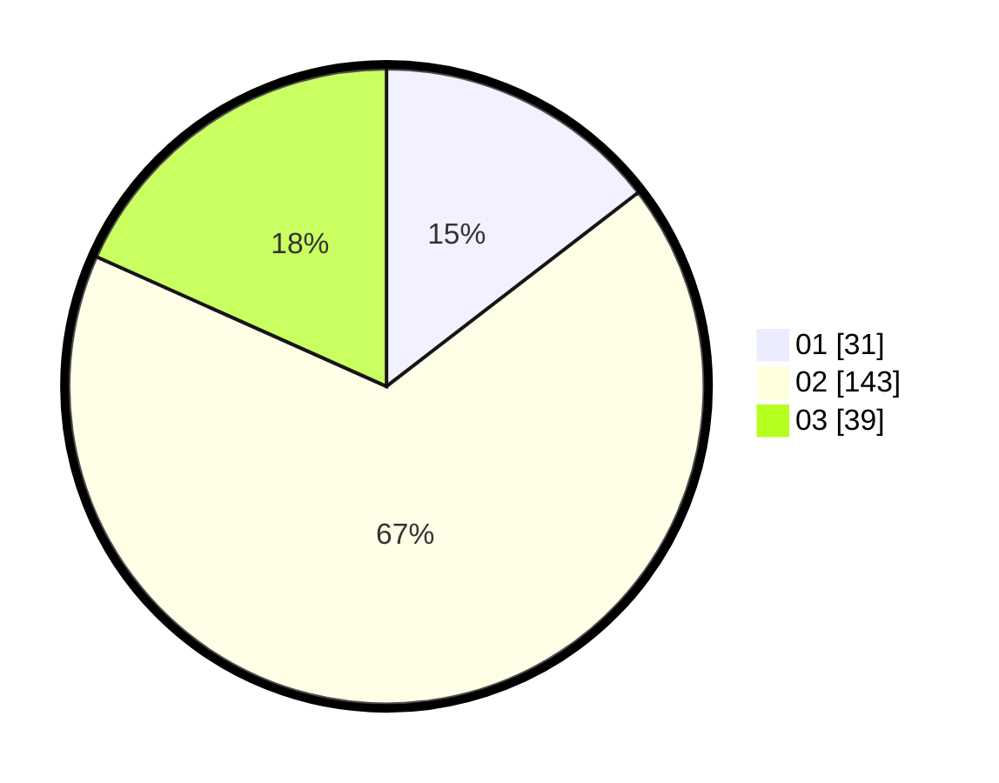

# Hasil

Hasil perolehan suara paslon dapat dilihat pada file paslon-01.txt, paslon-02.txt, dan paslon-03.txt.

Jika tidak ada, artinya data tersebut belum ada pada SIREKAP.

## Perolehan Suara

 * Paslon 01: **31**.
 * Paslon 02: **143**.
 * Paslon 03: **39**.

## Foto C Plano

https://sirekap-obj-formc.kpu.go.id/619e/pemilu/ppwp/31/72/01/10/03/3172011003028-20240216-193859--de6cdcb7-e5f7-480d-9caa-86f3954c7c4a.jpg

https://sirekap-obj-formc.kpu.go.id/619e/pemilu/ppwp/31/72/01/10/03/3172011003028-20240216-193923--b2d17f4f-4802-410a-82fd-15ebe01f30f1.jpg

https://sirekap-obj-formc.kpu.go.id/619e/pemilu/ppwp/31/72/01/10/03/3172011003028-20240216-193959--ef3e914b-de41-4cea-b533-f28b0a4e875c.jpg

## DATA PEMILIH TETAP

Jumlah pemilih dalam DPT: **280**.
 * L: **153**.
 * P: **127**.

## DATA PENGGUNA HAK PILIH

Jumlah pengguna hak pilih dalam DPT: **187**.
 * L: **96**.
 * P: **91**.

Jumlah pengguna hak pilih dalam DPTb: **15**.
 * L: **3**.
 * P: **12**.

Jumlah pengguna hak pilih dalam DPK: **11**.
 * L: **5**.
 * P: **6**.

Jumlah pengguna hak pilih: **213**.
 * L: **104**.
 * P: **109**.

## JUMLAH SUARA SAH DAN TIDAK SAH

JUMLAH SELURUH SUARA SAH: **213**.

JUMLAH SUARA TIDAK SAH: **4**.

JUMLAH SELURUH SUARA SAH DAN SUARA TIDAK SAH: **217**.
