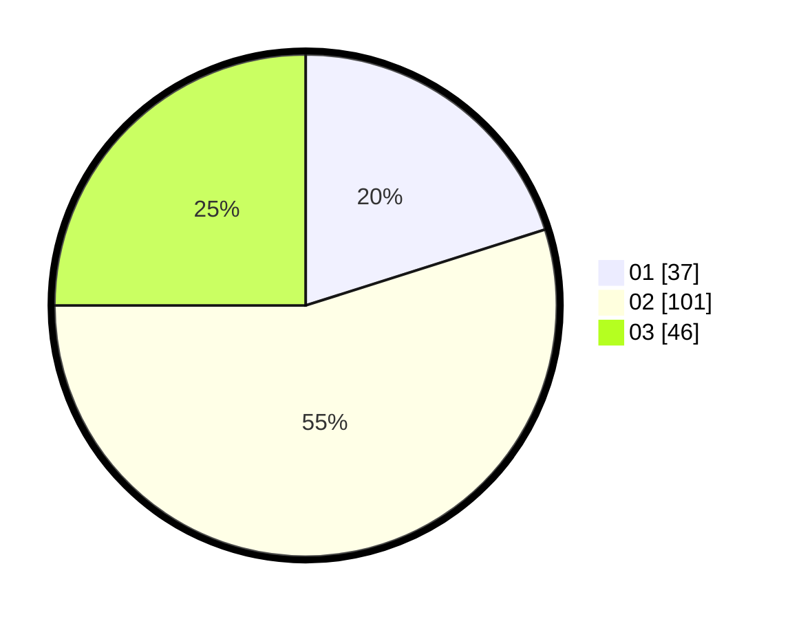

# Hasil

Hasil perolehan suara paslon dapat dilihat pada file paslon-01.txt, paslon-02.txt, dan paslon-03.txt.

Jika tidak ada, artinya data tersebut belum ada pada SIREKAP.

## Perolehan Suara

 * Paslon 01: **37**.
 * Paslon 02: **101**.
 * Paslon 03: **46**.

## Foto C Plano

https://sirekap-obj-formc.kpu.go.id/398b/pemilu/ppwp/31/72/01/10/03/3172011003031-20240216-194955--7acca0c2-396b-4558-9d8a-456e8074267d.jpg

https://sirekap-obj-formc.kpu.go.id/398b/pemilu/ppwp/31/72/01/10/03/3172011003031-20240216-195027--f62f3895-99a1-497b-b9a3-9b6d49e01cbb.jpg

https://sirekap-obj-formc.kpu.go.id/398b/pemilu/ppwp/31/72/01/10/03/3172011003031-20240216-195045--574a6ba1-9a2c-4289-b543-82c19e2fcfcb.jpg

## DATA PEMILIH TETAP

Jumlah pemilih dalam DPT: **282**.
 * L: **134**.
 * P: **148**.

## DATA PENGGUNA HAK PILIH

Jumlah pengguna hak pilih dalam DPT: **174**.
 * L: **86**.
 * P: **88**.

Jumlah pengguna hak pilih dalam DPTb: **14**.
 * L: **2**.
 * P: **12**.

Jumlah pengguna hak pilih dalam DPK: **0**.
 * L: **0**.
 * P: **0**.

Jumlah pengguna hak pilih: **188**.
 * L: **88**.
 * P: **100**.

## JUMLAH SUARA SAH DAN TIDAK SAH

JUMLAH SELURUH SUARA SAH: **184**.

JUMLAH SUARA TIDAK SAH: **4**.

JUMLAH SELURUH SUARA SAH DAN SUARA TIDAK SAH: **188**.
