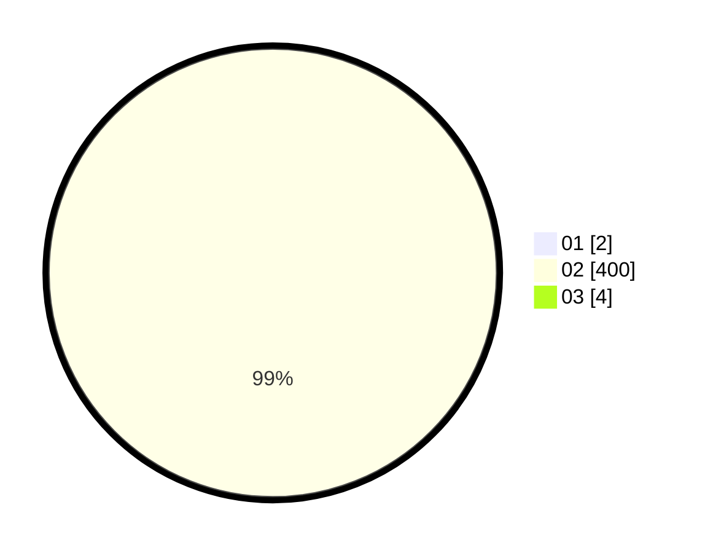

# Hasil

Hasil perolehan suara paslon dapat dilihat pada file paslon-01.txt, paslon-02.txt, dan paslon-03.txt.

Jika tidak ada, artinya data tersebut belum ada pada SIREKAP.

## Perolehan Suara

 * Paslon 01: **2**.
 * Paslon 02: **400**.
 * Paslon 03: **4**.

## Foto C Plano

https://sirekap-obj-formc.kpu.go.id/fb25/pemilu/ppwp/31/72/01/10/03/3172011003032-20240216-195154--9d12ea16-03fd-4303-8cd1-79a9efb827dd.jpg

https://sirekap-obj-formc.kpu.go.id/fb25/pemilu/ppwp/31/72/01/10/03/3172011003032-20240216-195216--95acc755-50b4-4324-b809-c8fb571fa2a0.jpg

https://sirekap-obj-formc.kpu.go.id/fb25/pemilu/ppwp/31/72/01/10/03/3172011003032-20240216-195258--92d905e7-6f52-4125-acc5-8f6a308e5384.jpg

## DATA PEMILIH TETAP

Jumlah pemilih dalam DPT: **292**.
 * L: **147**.
 * P: **145**.

## DATA PENGGUNA HAK PILIH

Jumlah pengguna hak pilih dalam DPT: **219**.
 * L: **113**.
 * P: **106**.

Jumlah pengguna hak pilih dalam DPTb: **3**.
 * L: **1**.
 * P: **2**.

Jumlah pengguna hak pilih dalam DPK: **4**.
 * L: **2**.
 * P: **2**.

Jumlah pengguna hak pilih: **226**.
 * L: **116**.
 * P: **110**.

## JUMLAH SUARA SAH DAN TIDAK SAH

JUMLAH SELURUH SUARA SAH: **223**.

JUMLAH SUARA TIDAK SAH: **3**.

JUMLAH SELURUH SUARA SAH DAN SUARA TIDAK SAH: **226**.
