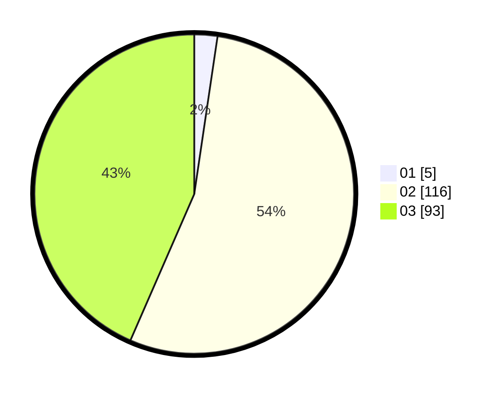

# Hasil

Hasil perolehan suara paslon dapat dilihat pada file paslon-01.txt, paslon-02.txt, dan paslon-03.txt.

Jika tidak ada, artinya data tersebut belum ada pada SIREKAP.

## Perolehan Suara

 * Paslon 01: **5**.
 * Paslon 02: **116**.
 * Paslon 03: **93**.

## Foto C Plano

https://sirekap-obj-formc.kpu.go.id/36b2/pemilu/ppwp/31/72/01/10/03/3172011003034-20240216-195829--02b5fb48-ba6f-46e8-8f58-56a858c646c1.jpg

https://sirekap-obj-formc.kpu.go.id/36b2/pemilu/ppwp/31/72/01/10/03/3172011003034-20240216-195852--6d360e94-ec45-446b-8429-b0388c46d908.jpg

https://sirekap-obj-formc.kpu.go.id/36b2/pemilu/ppwp/31/72/01/10/03/3172011003034-20240216-195931--b0202c58-40ea-4240-9190-b1b0ccda4c07.jpg

## DATA PEMILIH TETAP

Jumlah pemilih dalam DPT: **288**.
 * L: **146**.
 * P: **142**.

## DATA PENGGUNA HAK PILIH

Jumlah pengguna hak pilih dalam DPT: **202**.
 * L: **106**.
 * P: **96**.

Jumlah pengguna hak pilih dalam DPTb: **10**.
 * L: **2**.
 * P: **8**.

Jumlah pengguna hak pilih dalam DPK: **1**.
 * L: **0**.
 * P: **1**.

Jumlah pengguna hak pilih: **213**.
 * L: **108**.
 * P: **105**.

## JUMLAH SUARA SAH DAN TIDAK SAH

JUMLAH SELURUH SUARA SAH: **214**.

JUMLAH SUARA TIDAK SAH: **4**.

JUMLAH SELURUH SUARA SAH DAN SUARA TIDAK SAH: **218**.
