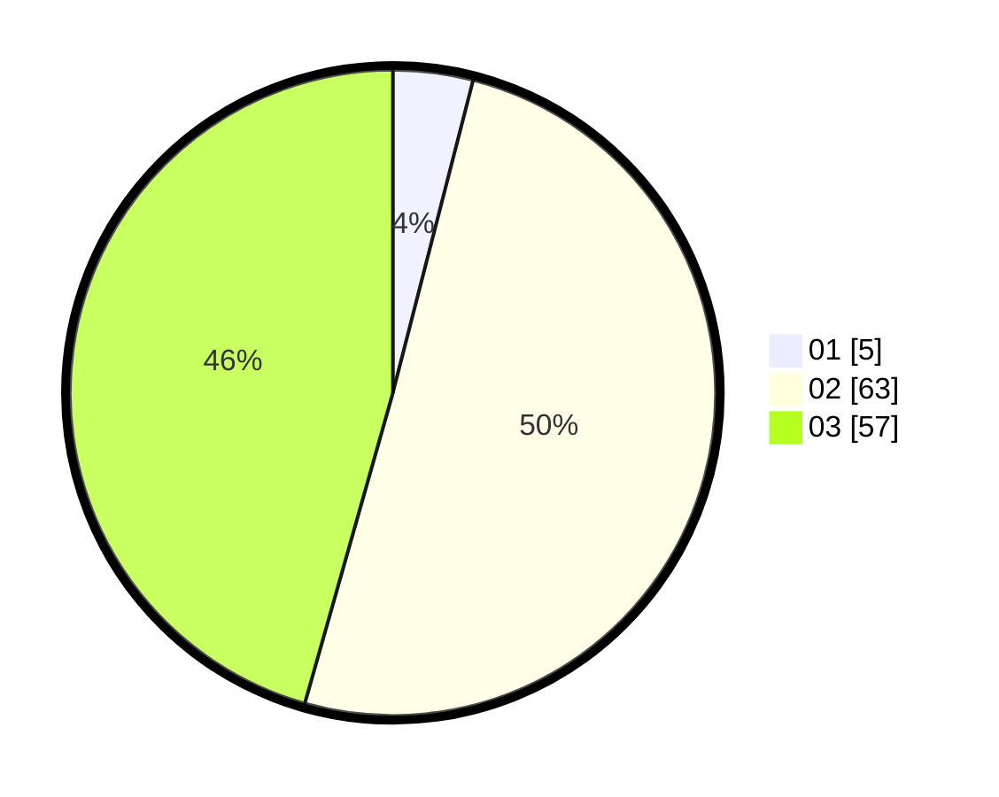

# Hasil

Hasil perolehan suara paslon dapat dilihat pada file paslon-01.txt, paslon-02.txt, dan paslon-03.txt.

Jika tidak ada, artinya data tersebut belum ada pada SIREKAP.

## Perolehan Suara

 * Paslon 01: **5**.
 * Paslon 02: **63**.
 * Paslon 03: **57**.

## Foto C Plano

https://sirekap-obj-formc.kpu.go.id/c9f9/pemilu/ppwp/31/72/01/10/03/3172011003039-20240216-205720--3677c63e-4d91-4b4a-acd0-8d2f96a47d27.jpg

https://sirekap-obj-formc.kpu.go.id/c9f9/pemilu/ppwp/31/72/01/10/03/3172011003039-20240216-205737--b1edde55-426b-43d1-bf75-824c21495dc8.jpg

https://sirekap-obj-formc.kpu.go.id/c9f9/pemilu/ppwp/31/72/01/10/03/3172011003039-20240216-205803--848c34b1-9bf3-4799-845a-4dae309c410a.jpg

## DATA PEMILIH TETAP

Jumlah pemilih dalam DPT: **202**.
 * L: **103**.
 * P: **99**.

## DATA PENGGUNA HAK PILIH

Jumlah pengguna hak pilih dalam DPT: **131**.
 * L: **68**.
 * P: **63**.

Jumlah pengguna hak pilih dalam DPTb: **0**.
 * L: **0**.
 * P: **0**.

Jumlah pengguna hak pilih dalam DPK: **0**.
 * L: **0**.
 * P: **0**.

Jumlah pengguna hak pilih: **131**.
 * L: **68**.
 * P: **63**.

## JUMLAH SUARA SAH DAN TIDAK SAH

JUMLAH SELURUH SUARA SAH: **125**.

JUMLAH SUARA TIDAK SAH: **6**.

JUMLAH SELURUH SUARA SAH DAN SUARA TIDAK SAH: **131**.
