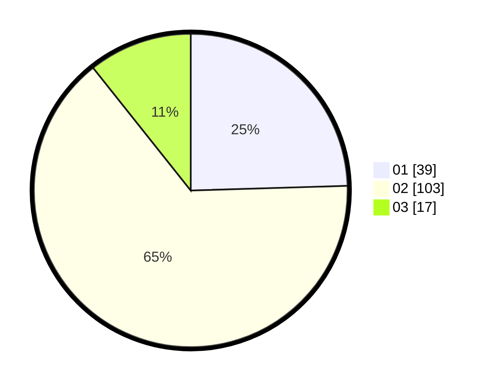

# Hasil

Hasil perolehan suara paslon dapat dilihat pada file paslon-01.txt, paslon-02.txt, dan paslon-03.txt.

Jika tidak ada, artinya data tersebut belum ada pada SIREKAP.

## Perolehan Suara

 * Paslon 01: **39**.
 * Paslon 02: **103**.
 * Paslon 03: **17**.

## Foto C Plano

https://sirekap-obj-formc.kpu.go.id/af9d/pemilu/ppwp/31/72/01/10/03/3172011003051-20240215-022423--27b7a285-e332-4dc7-99a1-90f6dcf21e6c.jpg

https://sirekap-obj-formc.kpu.go.id/af9d/pemilu/ppwp/31/72/01/10/03/3172011003051-20240214-205916--6dcb8ed3-6d8b-41fc-b07e-3a4873d17bb3.jpg

https://sirekap-obj-formc.kpu.go.id/af9d/pemilu/ppwp/31/72/01/10/03/3172011003051-20240214-233912--e135c38d-6eb1-49ff-9ec0-db217bea9595.jpg

## DATA PEMILIH TETAP

Jumlah pemilih dalam DPT: **280**.
 * L: **146**.
 * P: **134**.

## DATA PENGGUNA HAK PILIH

Jumlah pengguna hak pilih dalam DPT: **156**.
 * L: **70**.
 * P: **86**.

Jumlah pengguna hak pilih dalam DPTb: **5**.
 * L: **2**.
 * P: **3**.

Jumlah pengguna hak pilih dalam DPK: **2**.
 * L: **1**.
 * P: **1**.

Jumlah pengguna hak pilih: **163**.
 * L: **73**.
 * P: **90**.

## JUMLAH SUARA SAH DAN TIDAK SAH

JUMLAH SELURUH SUARA SAH: **159**.

JUMLAH SUARA TIDAK SAH: **4**.

JUMLAH SELURUH SUARA SAH DAN SUARA TIDAK SAH: **163**.
