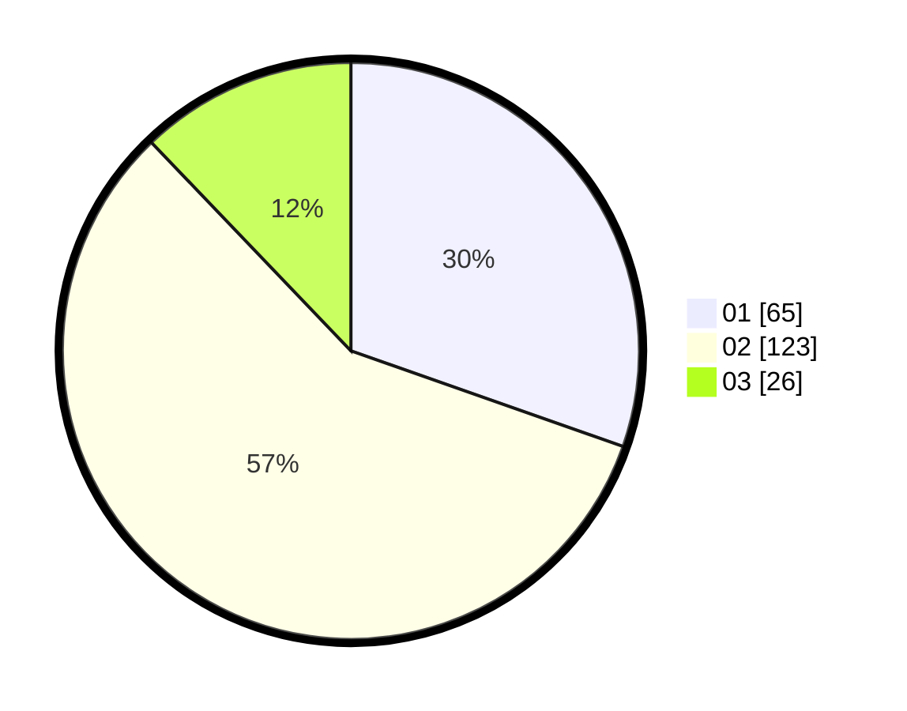

# Hasil

Hasil perolehan suara paslon dapat dilihat pada file paslon-01.txt, paslon-02.txt, dan paslon-03.txt.

Jika tidak ada, artinya data tersebut belum ada pada SIREKAP.

## Perolehan Suara

 * Paslon 01: **65**.
 * Paslon 02: **123**.
 * Paslon 03: **26**.

## Foto C Plano

https://sirekap-obj-formc.kpu.go.id/0b4f/pemilu/ppwp/31/72/01/10/03/3172011003063-20240215-040445--d30a0a7b-3a0a-4873-8f8d-46ce0e0514fb.jpg

https://sirekap-obj-formc.kpu.go.id/0b4f/pemilu/ppwp/31/72/01/10/03/3172011003063-20240215-040642--00c89a7c-a857-42ae-90de-5eeda09b70ea.jpg

https://sirekap-obj-formc.kpu.go.id/0b4f/pemilu/ppwp/31/72/01/10/03/3172011003063-20240216-192903--655f5ea7-7e3a-4ae4-a3f9-09a0c5ac757b.jpg
