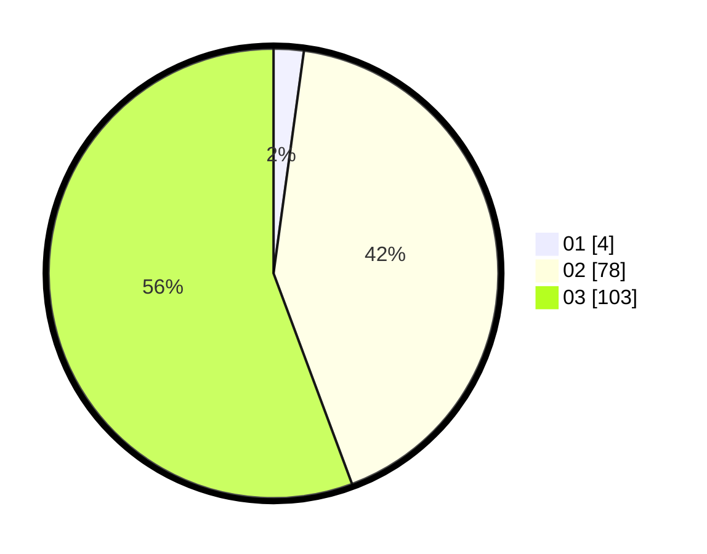

# Hasil

Hasil perolehan suara paslon dapat dilihat pada file paslon-01.txt, paslon-02.txt, dan paslon-03.txt.

Jika tidak ada, artinya data tersebut belum ada pada SIREKAP.

## Perolehan Suara

 * Paslon 01: **4**.
 * Paslon 02: **78**.
 * Paslon 03: **103**.

## Foto C Plano

https://sirekap-obj-formc.kpu.go.id/775f/pemilu/ppwp/31/72/01/10/03/3172011003074-20240214-212230--fee7e814-ff65-4e8c-bbda-8b3baafee663.jpg

https://sirekap-obj-formc.kpu.go.id/775f/pemilu/ppwp/31/72/01/10/03/3172011003074-20240214-212312--2e32947b-e980-4ed2-b2a3-ce1144aaed47.jpg

https://sirekap-obj-formc.kpu.go.id/775f/pemilu/ppwp/31/72/01/10/03/3172011003074-20240214-212350--4beaa1f5-bc41-4579-8866-c5c46c7f2155.jpg

## DATA PEMILIH TETAP

Jumlah pemilih dalam DPT: **279**.
 * L: **147**.
 * P: **132**.

## DATA PENGGUNA HAK PILIH

Jumlah pengguna hak pilih dalam DPT: **184**.
 * L: **93**.
 * P: **91**.

Jumlah pengguna hak pilih dalam DPTb: **1**.
 * L: **1**.
 * P: **0**.

Jumlah pengguna hak pilih dalam DPK: **1**.
 * L: **1**.
 * P: **0**.

Jumlah pengguna hak pilih: **186**.
 * L: **95**.
 * P: **91**.

## JUMLAH SUARA SAH DAN TIDAK SAH

JUMLAH SELURUH SUARA SAH: **185**.

JUMLAH SUARA TIDAK SAH: **99**.

JUMLAH SELURUH SUARA SAH DAN SUARA TIDAK SAH: **284**.
