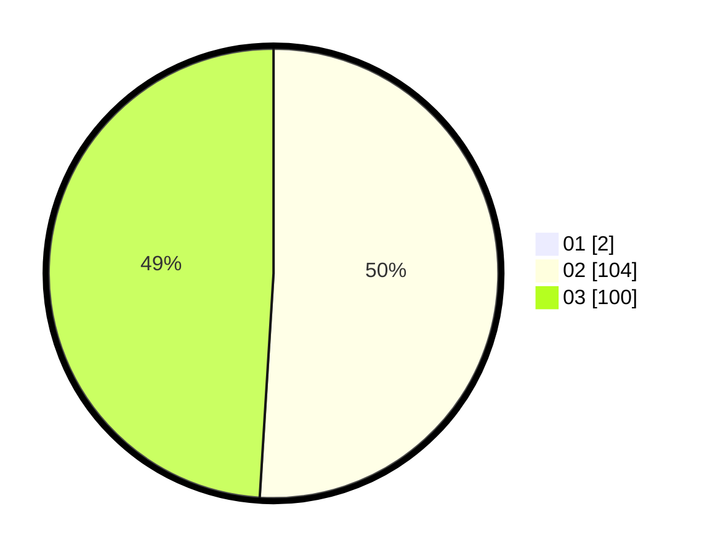

# Hasil

Hasil perolehan suara paslon dapat dilihat pada file paslon-01.txt, paslon-02.txt, dan paslon-03.txt.

Jika tidak ada, artinya data tersebut belum ada pada SIREKAP.

## Perolehan Suara

 * Paslon 01: **2**.
 * Paslon 02: **104**.
 * Paslon 03: **100**.

## Foto C Plano

https://sirekap-obj-formc.kpu.go.id/39e6/pemilu/ppwp/31/72/01/10/03/3172011003120-20240215-190115--fb2eaa39-af4c-4d9b-b752-109a5e95eebd.jpg

https://sirekap-obj-formc.kpu.go.id/39e6/pemilu/ppwp/31/72/01/10/03/3172011003120-20240215-190022--b0b1b40d-eb08-4f87-8097-25f62a48f0d2.jpg

https://sirekap-obj-formc.kpu.go.id/39e6/pemilu/ppwp/31/72/01/10/03/3172011003120-20240215-074534--c70f328c-0bb8-4766-8ab6-95a239cd614c.jpg

## DATA PEMILIH TETAP

Jumlah pemilih dalam DPT: **252**.
 * L: **125**.
 * P: **127**.

## DATA PENGGUNA HAK PILIH

Jumlah pengguna hak pilih dalam DPT: **194**.
 * L: **95**.
 * P: **99**.

Jumlah pengguna hak pilih dalam DPTb: **10**.
 * L: **4**.
 * P: **6**.

Jumlah pengguna hak pilih dalam DPK: **5**.
 * L: **2**.
 * P: **3**.

Jumlah pengguna hak pilih: **209**.
 * L: **101**.
 * P: **108**.

## JUMLAH SUARA SAH DAN TIDAK SAH

JUMLAH SELURUH SUARA SAH: **206**.

JUMLAH SUARA TIDAK SAH: **3**.

JUMLAH SELURUH SUARA SAH DAN SUARA TIDAK SAH: **209**.
