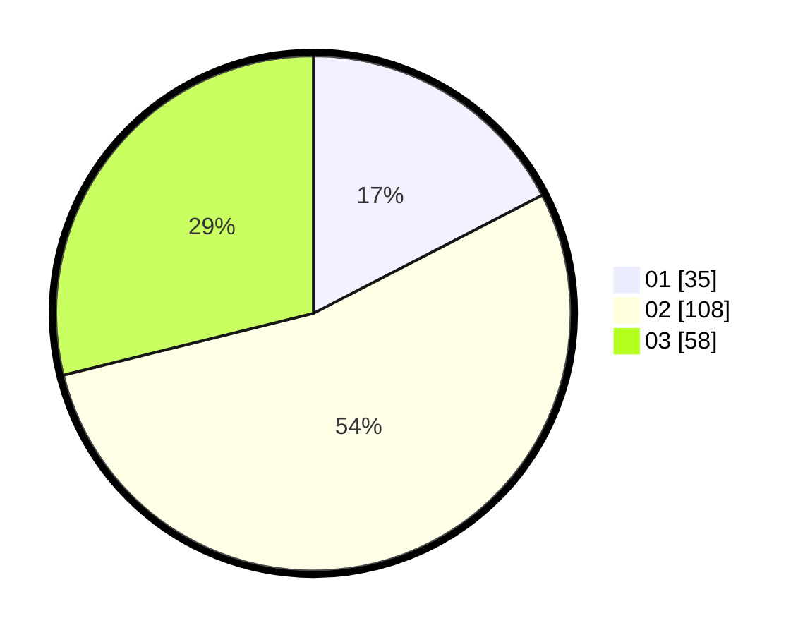

# Hasil

Hasil perolehan suara paslon dapat dilihat pada file paslon-01.txt, paslon-02.txt, dan paslon-03.txt.

Jika tidak ada, artinya data tersebut belum ada pada SIREKAP.

## Perolehan Suara

 * Paslon 01: **35**.
 * Paslon 02: **108**.
 * Paslon 03: **58**.

## Foto C Plano

https://sirekap-obj-formc.kpu.go.id/8cb6/pemilu/ppwp/31/72/01/10/04/3172011004001-20240216-144803--1b8456e8-a5f5-46d9-8634-4c3bfcdc0040.jpg

https://sirekap-obj-formc.kpu.go.id/8cb6/pemilu/ppwp/31/72/01/10/04/3172011004001-20240216-145248--ae3eb424-3bc1-4c3e-b5fb-d985abd6c136.jpg

https://sirekap-obj-formc.kpu.go.id/8cb6/pemilu/ppwp/31/72/01/10/04/3172011004001-20240216-145407--05b3dedc-9a6b-4a50-9311-33b6ab527b94.jpg

## DATA PEMILIH TETAP

Jumlah pemilih dalam DPT: **278**.
 * L: **141**.
 * P: **137**.

## DATA PENGGUNA HAK PILIH

Jumlah pengguna hak pilih dalam DPT: **201**.
 * L: **98**.
 * P: **103**.

Jumlah pengguna hak pilih dalam DPTb: **7**.
 * L: **3**.
 * P: **4**.

Jumlah pengguna hak pilih dalam DPK: **0**.
 * L: **0**.
 * P: **0**.

Jumlah pengguna hak pilih: **208**.
 * L: **101**.
 * P: **107**.

## JUMLAH SUARA SAH DAN TIDAK SAH

JUMLAH SELURUH SUARA SAH: **201**.

JUMLAH SUARA TIDAK SAH: **7**.

JUMLAH SELURUH SUARA SAH DAN SUARA TIDAK SAH: **208**.
